# NYC Trip - Exploratory Data Analysis

Even thought the main purpose of this project is to predict the tips
that taxi drivers received from passenger is important to have general
understanding of the data to **avoid ending with wrong conclusions**.

To perform this EDA I will:

- **Understanding the distribution of each variable:** That will give a
  reference of the normality.

- Validate if the data has missing values

- Create new features base on domain knowledge

- Confirm assumptions

## Setting-up the enviroment

1.  Loading main packages

``` r
library(data.table)
library(lubridate)
```


    Attaching package: 'lubridate'

    The following objects are masked from 'package:data.table':

        hour, isoweek, mday, minute, month, quarter, second, wday, week,
        yday, year

    The following objects are masked from 'package:base':

        date, intersect, setdiff, union

``` r
library(timeDate)
library(ggplot2)
library(scales)
library(patchwork)
library(here)
```

    here() starts at C:/Users/angel/R-folder/nyc-taxi-project

``` r
theme_set(theme_light())

source(here("01-EDA/00-custom-functions.R"))
```

2.  Importing from data from January to March as our training data with
    **56,853,541 rows** as our training corresponding to **10 Gb**.

``` r
TripDataTrain <- fst::read_fst(
  path = here("00-data/TripDataTrain.fst"),
  as.data.table = TRUE
)

TripDataDim <- dim(TripDataTrain)
comma(TripDataDim)
```

    [1] "56,853,541" "24"        

3.  Down sampling the data to **17,000,000 rows** to solve memory
    limitations problems, but keeping a representative sample of the
    population.

``` r
set.seed(20230922)
TripDataTrain <- TripDataTrain[sample.int(TripDataDim[1L],17e6)]

TripDataDim <- dim(TripDataTrain)
comma(TripDataDim)
```

    [1] "17,000,000" "24"        

3.  Decoding data based on dictionary information.

``` r
TripDataTrain <- decode_cols(
  trip_table = TripDataTrain,
  zone_path = here("00-data/taxi_zone_lookup.csv")
)
```

## Validating the distribution of each variable

### Categorical variables

By counting the rows by category for each row we found that:

- We can **remove** the `dispatching_base_num` and
  `originating_base_num` as theirs information is really close to the
  `hvfhs_license_num` and their other values only represent **0.02%** of
  the rows.
- Based on `shared_request_flag` and `shared_match_flag` we know that
  must of the passengers **agree to shared the ride** even if other
  passenger booked separately.
- Based on `access_a_ride_flag` we know that must of the **trips were
  administered by MTA**. We also could that the field is missing the “Y”
  flag.
- Based on `wav_request_flag` and `wav_match_flag` we know that only
  **0.16%** of trips requested a wheelchair-accessible vehicle but
  **6.84%** of trips had that capacity with are really good news.
- In the `PU_Borough` and `DO_Borough`columns very few trips pass
  through “Staten Island”, “Unknown” or “EWR” so we will consolidate
  them as “Other”.
- `PU_Zone` and `DO_Zone` have too many categories and we don’t need
  them for this process.
- As “EWR” represent the **Newark Liberty International Airport** and
  represent very few trips, we can consolidate this category to the must
  general one “Airports” for the `PU_service_zone` and `DO_service_zone`
  columns

``` r
cat_vars <- TripDataTrain[, names(.SD), .SDcols = is.character]

for(cat_i in cat_vars){
  TripDataTrain[, .(count = .N), 
                by = cat_i
  ][, pct_count := round(count/sum(count)*100, 2)
  ][order(-count)] |>
  print()
}
```

       hvfhs_license_num    count pct_count
    1:              Uber 12383090     72.84
    2:              Lyft  4616910     27.16
        dispatching_base_num    count pct_count
     1:               B03404 12379708     72.82
     2:               B03406  4616910     27.16
     3:               B02764     1207      0.01
     4:               B02870      435      0.00
     5:               B02872      260      0.00
     6:               B02835      239      0.00
     7:               B02871      186      0.00
     8:               B02889      159      0.00
     9:               B02869      154      0.00
    10:               B02887      148      0.00
    11:               B02882      117      0.00
    12:               B02765      113      0.00
    13:               B02877       92      0.00
    14:               B02876       86      0.00
    15:               B02879       80      0.00
    16:               B02864       57      0.00
    17:               B02884       39      0.00
    18:               B02875        5      0.00
    19:               B02865        4      0.00
    20:               B02866        1      0.00
        originating_base_num    count pct_count
     1:               B03404 12379659     72.82
     2:                 <NA>  4610431     27.12
     3:               B03406     6479      0.04
     4:               B02764     1207      0.01
     5:               B02870      435      0.00
     6:               B02872      260      0.00
     7:               B02835      239      0.00
     8:               B02871      186      0.00
     9:               B02889      159      0.00
    10:               B02869      154      0.00
    11:               B02887      148      0.00
    12:               B02882      117      0.00
    13:               B02765      113      0.00
    14:               B02877       92      0.00
    15:               B02876       86      0.00
    16:               B02879       80      0.00
    17:               B02864       57      0.00
    18:               B02026       41      0.00
    19:               B02884       39      0.00
    20:               B02875        5      0.00
    21:               B00887        5      0.00
    22:               B02865        4      0.00
    23:               B03153        3      0.00
    24:               B02866        1      0.00
        originating_base_num    count pct_count
       shared_request_flag    count pct_count
    1:                   N 16523434      97.2
    2:                   Y   476566       2.8
       shared_match_flag    count pct_count
    1:                 N 16809807     98.88
    2:                 Y   190193      1.12
       access_a_ride_flag    count pct_count
    1:                    12383090     72.84
    2:                  N  4616910     27.16
       wav_request_flag    count pct_count
    1:                N 16973255     99.84
    2:                Y    26745      0.16
       wav_match_flag    count pct_count
    1:              N 15836328     93.15
    2:              Y  1163672      6.85
          PU_Borough   count pct_count
    1:     Manhattan 6997027     41.16
    2:      Brooklyn 4394615     25.85
    3:        Queens 3330173     19.59
    4:         Bronx 2046836     12.04
    5: Staten Island  230473      1.36
    6:       Unknown     876      0.01
                                               PU_Zone  count pct_count
      1:                                   JFK Airport 298850      1.76
      2:                             LaGuardia Airport 287131      1.69
      3:                                  East Village 256811      1.51
      4:                           Crown Heights North 223611      1.32
      5:                     Times Sq/Theatre District 219143      1.29
     ---                                                               
    256:                               Freshkills Park    310      0.00
    257:                                 Rikers Island     20      0.00
    258:                              Great Kills Park     19      0.00
    259:                                   Jamaica Bay     13      0.00
    260: Governor's Island/Ellis Island/Liberty Island      4      0.00
       PU_service_zone    count pct_count
    1:       Boro Zone 10408812     61.23
    2:     Yellow Zone  6004331     35.32
    3:        Airports   585981      3.45
    4:             N/A      876      0.01
          DO_Borough   count pct_count
    1:     Manhattan 6429949     37.82
    2:      Brooklyn 4363404     25.67
    3:        Queens 3257841     19.16
    4:         Bronx 1949557     11.47
    5:       Unknown  659612      3.88
    6: Staten Island  227385      1.34
    7:           EWR  112252      0.66
                                               DO_Zone  count pct_count
      1:                                            NA 659612      3.88
      2:                                   JFK Airport 344525      2.03
      3:                             LaGuardia Airport 318615      1.87
      4:                           Crown Heights North 234324      1.38
      5:                                  East Village 217604      1.28
     ---                                                               
    257:                                  Astoria Park    347      0.00
    258:                              Great Kills Park     32      0.00
    259:                                   Jamaica Bay     20      0.00
    260: Governor's Island/Ellis Island/Liberty Island      7      0.00
    261:                                 Rikers Island      1      0.00
       DO_service_zone    count pct_count
    1:       Boro Zone 10112798     59.49
    2:     Yellow Zone  5452198     32.07
    3:        Airports   663140      3.90
    4:             N/A   659612      3.88
    5:             EWR   112252      0.66

### Numerical variables

To validate numeric variables we are potting at normal and logarithmic
scale.

``` r
num_vars <- TripDataTrain[, names(.SD), .SDcols = is.numeric]

for(num_i in num_vars){
  
 print(custom_histogram(TripDataTrain, num_i))

}
```

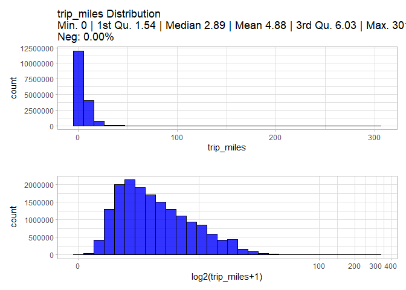

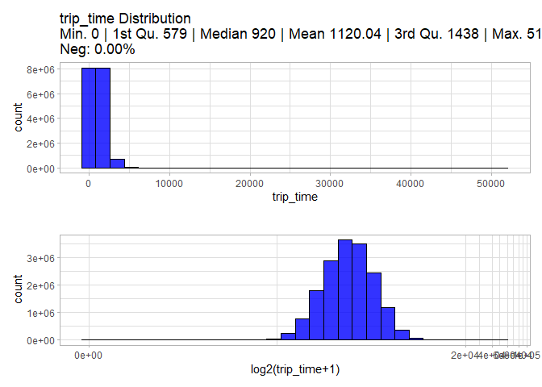

    Warning in self$trans$transform(x): NaNs produced

    Warning: Transformation introduced infinite values in continuous x-axis

    Warning: Removed 13155 rows containing non-finite values (`stat_bin()`).

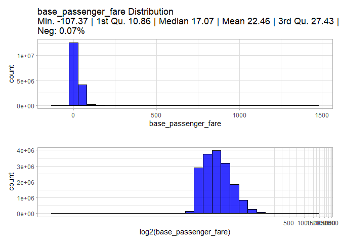

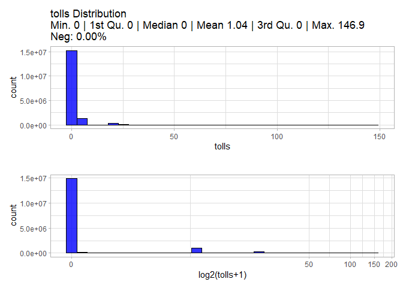

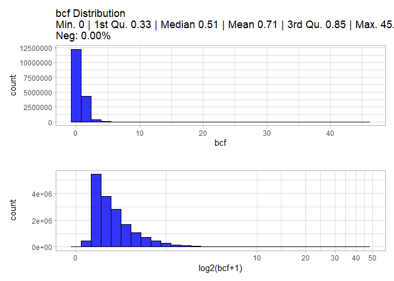

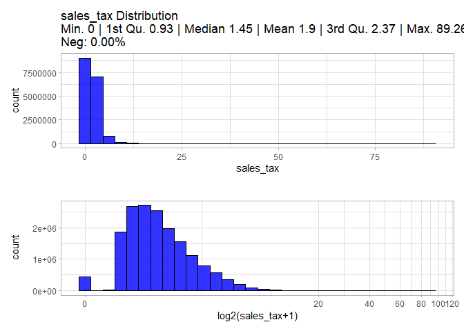

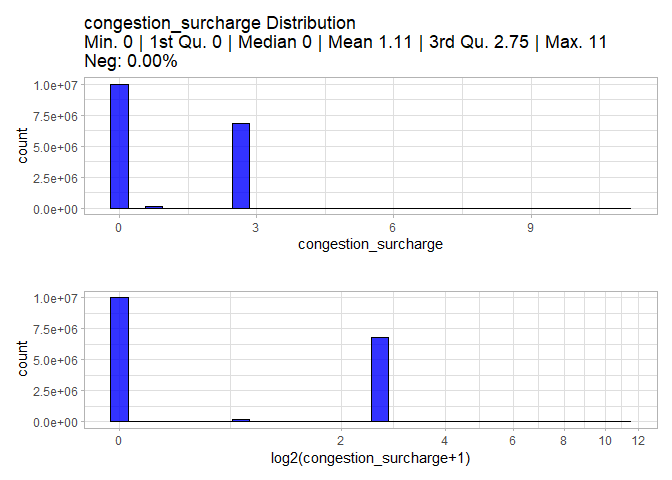

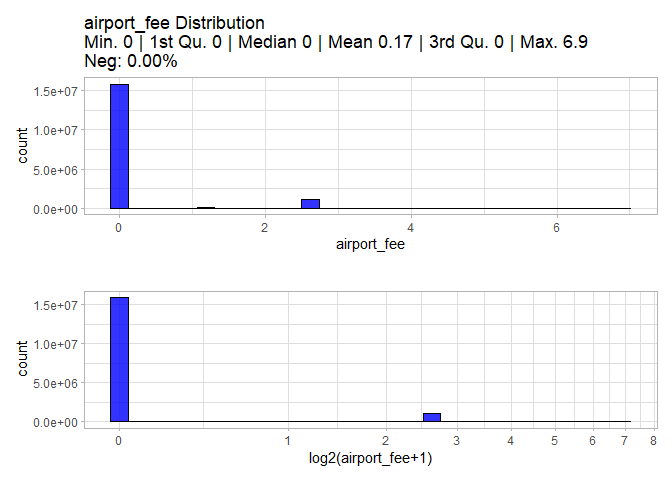

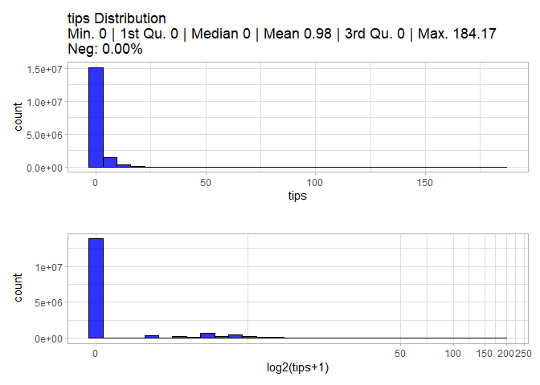

    Warning in self$trans$transform(x): NaNs produced

    Warning: Transformation introduced infinite values in continuous x-axis

    Warning: Removed 271813 rows containing non-finite values (`stat_bin()`).

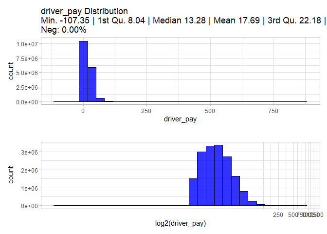

### Date variables

To validate numeric variables we are potting at normal and logarithmic
scale.

``` r
date_vars <- TripDataTrain[, names(.SD), .SDcols = is.POSIXct]

for(date_i in date_vars){
  
  date_hist <-
    ggplot(TripDataTrain, aes(get(date_i)))+
    geom_histogram(fill = "blue",
                   color = "black",
                   alpha = 0.8,
                   bins = 30)+
    labs(title = paste0(date_i, " Distribution"),
         x = date_i)
  
  print(date_hist)
}
```

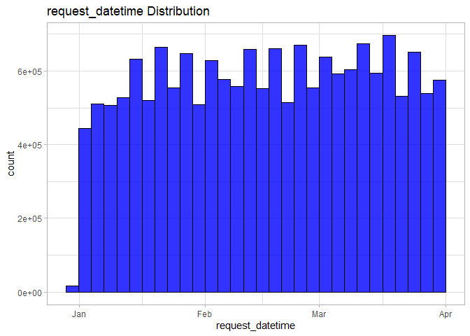

    Warning: Removed 4610431 rows containing non-finite values (`stat_bin()`).

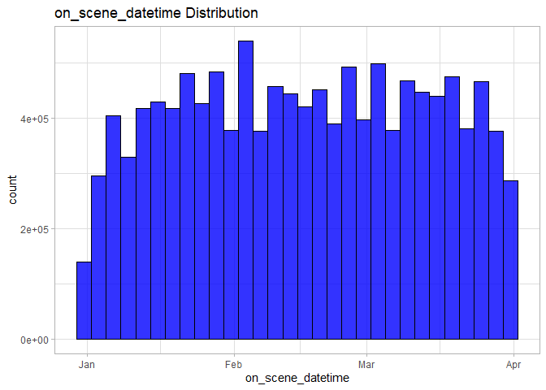

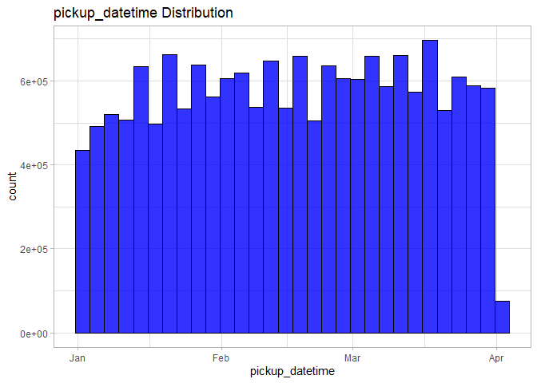

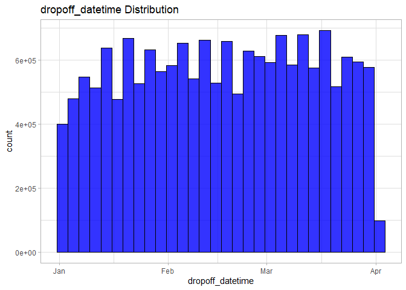
