# NYC Trip - Exploratory Data Analysis

## Description

Although the primary objective of this project is to **predict the
tips** that taxi drivers receive from passengers, it’s crucial to have a
comprehensive understanding of the data to **avoid drawing incorrect
conclusions**. To achieve this, we will perform the following steps:

1.  **Explore the distribution of each individual variable** to
    understand what is typical or atypical and identify data quality
    issues.
2.  **Validate domain knowledge assumptions** to uncover data quality
    problems or correct erroneous assumptions that could potentially
    affect our final conclusions.
3.  **Create new features** based on domain knowledge to enhance the
    likelihood of discovering valuable insights.
4.  **Impute missing values** to prevent introducing bias.
5.  **Use PCA and EFA** to understand the correlation between features.

## Setting Up The Environment

1.  Loading main packages

``` r
library(here)
library(data.table)
library(lubridate)
library(ggplot2)
library(scales)
library(patchwork)
theme_set(theme_light())

source(here("01-EDA/00-custom-functions.R"))
```

2.  Importing data from January to March as our training data with
    **56,853,541 rows** corresponding to **10 GB**.

``` r
TripDataTrain <- fst::read_fst(
  path = here("00-data/TripDataTrain.fst"),
  as.data.table = TRUE
)

TripDataDim <- dim(TripDataTrain)
comma(TripDataDim)
```

    [1] "56,853,541" "24"        

3.  Downsampling the data to **17,000,000 rows** to solve memory
    limitation problems, but keeping a **representative sample** of the
    population.

``` r
set.seed(20230922)
TripDataTrain <- TripDataTrain[sample.int(TripDataDim[1L],17e6)]

TripDataDim <- dim(TripDataTrain)
comma(TripDataDim)
```

    [1] "17,000,000" "24"        

4.  Decoding data based on dictionary information.

``` r
TripDataTrain <- decode_cols(
  trip_table = TripDataTrain,
  zone_path = here("00-data/taxi_zone_lookup.csv")
)
```

## 1. Variable Distribution

To avoid spending too much time on this step, use the same visualization
based on the variable’s type.

### Categorical Variables Distribution

``` r
cat_vars <- TripDataTrain[, names(.SD), .SDcols = is.character]

for(cat_i in cat_vars){
  TripDataTrain[, .(count = .N), 
                by = cat_i
  ][, pct_count := round(count/sum(count)*100, 2)
  ][order(-count)] |>
  print()
}
```

       hvfhs_license_num    count pct_count
    1:              Uber 12383090     72.84
    2:              Lyft  4616910     27.16
        dispatching_base_num    count pct_count
     1:               B03404 12379708     72.82
     2:               B03406  4616910     27.16
     3:               B02764     1207      0.01
     4:               B02870      435      0.00
     5:               B02872      260      0.00
     6:               B02835      239      0.00
     7:               B02871      186      0.00
     8:               B02889      159      0.00
     9:               B02869      154      0.00
    10:               B02887      148      0.00
    11:               B02882      117      0.00
    12:               B02765      113      0.00
    13:               B02877       92      0.00
    14:               B02876       86      0.00
    15:               B02879       80      0.00
    16:               B02864       57      0.00
    17:               B02884       39      0.00
    18:               B02875        5      0.00
    19:               B02865        4      0.00
    20:               B02866        1      0.00
        originating_base_num    count pct_count
     1:               B03404 12379659     72.82
     2:                 <NA>  4610431     27.12
     3:               B03406     6479      0.04
     4:               B02764     1207      0.01
     5:               B02870      435      0.00
     6:               B02872      260      0.00
     7:               B02835      239      0.00
     8:               B02871      186      0.00
     9:               B02889      159      0.00
    10:               B02869      154      0.00
    11:               B02887      148      0.00
    12:               B02882      117      0.00
    13:               B02765      113      0.00
    14:               B02877       92      0.00
    15:               B02876       86      0.00
    16:               B02879       80      0.00
    17:               B02864       57      0.00
    18:               B02026       41      0.00
    19:               B02884       39      0.00
    20:               B02875        5      0.00
    21:               B00887        5      0.00
    22:               B02865        4      0.00
    23:               B03153        3      0.00
    24:               B02866        1      0.00
        originating_base_num    count pct_count
       shared_request_flag    count pct_count
    1:                   N 16523434      97.2
    2:                   Y   476566       2.8
       shared_match_flag    count pct_count
    1:                 N 16809807     98.88
    2:                 Y   190193      1.12
       access_a_ride_flag    count pct_count
    1:                    12383090     72.84
    2:                  N  4616910     27.16
       wav_request_flag    count pct_count
    1:                N 16973255     99.84
    2:                Y    26745      0.16
       wav_match_flag    count pct_count
    1:              N 15836328     93.15
    2:              Y  1163672      6.85
          PU_Borough   count pct_count
    1:     Manhattan 6997027     41.16
    2:      Brooklyn 4394615     25.85
    3:        Queens 3330173     19.59
    4:         Bronx 2046836     12.04
    5: Staten Island  230473      1.36
    6:       Unknown     876      0.01
                                               PU_Zone  count pct_count
      1:                                   JFK Airport 298850      1.76
      2:                             LaGuardia Airport 287131      1.69
      3:                                  East Village 256811      1.51
      4:                           Crown Heights North 223611      1.32
      5:                     Times Sq/Theatre District 219143      1.29
     ---                                                               
    256:                               Freshkills Park    310      0.00
    257:                                 Rikers Island     20      0.00
    258:                              Great Kills Park     19      0.00
    259:                                   Jamaica Bay     13      0.00
    260: Governor's Island/Ellis Island/Liberty Island      4      0.00
       PU_service_zone    count pct_count
    1:       Boro Zone 10408812     61.23
    2:     Yellow Zone  6004331     35.32
    3:        Airports   585981      3.45
    4:             N/A      876      0.01
          DO_Borough   count pct_count
    1:     Manhattan 6429949     37.82
    2:      Brooklyn 4363404     25.67
    3:        Queens 3257841     19.16
    4:         Bronx 1949557     11.47
    5:       Unknown  659612      3.88
    6: Staten Island  227385      1.34
    7:           EWR  112252      0.66
                                               DO_Zone  count pct_count
      1:                                            NA 659612      3.88
      2:                                   JFK Airport 344525      2.03
      3:                             LaGuardia Airport 318615      1.87
      4:                           Crown Heights North 234324      1.38
      5:                                  East Village 217604      1.28
     ---                                                               
    257:                                  Astoria Park    347      0.00
    258:                              Great Kills Park     32      0.00
    259:                                   Jamaica Bay     20      0.00
    260: Governor's Island/Ellis Island/Liberty Island      7      0.00
    261:                                 Rikers Island      1      0.00
       DO_service_zone    count pct_count
    1:       Boro Zone 10112798     59.49
    2:     Yellow Zone  5452198     32.07
    3:        Airports   663140      3.90
    4:             N/A   659612      3.88
    5:             EWR   112252      0.66

#### Findings

By counting the rows by category for each row, we found that:

- We can **remove** the `dispatching_base_num` and
  `originating_base_num` as their information is very close to the
  `hvfhs_license_num`, and their other values only represent **0.02%**
  of the rows.

- Based on `shared_request_flag` and `shared_match_flag`, we know that
  most of the passengers **agree to share the ride** even if other
  passengers booked separately.

- Based on `access_a_ride_flag`, we know that most of the **trips were
  administered by MTA**. We also found that the field is missing the “Y”
  flag.

- Based on `wav_request_flag` and `wav_match_flag`, we know that only
  **0.16%** of trips requested a wheelchair-accessible vehicle, but
  **6.84%** of trips had that capacity, which is really good news.

- In the `PU_Borough` and `DO_Borough` columns, very few trips pass
  through “Staten Island”, “Unknown”, or “EWR”, so we will consolidate
  them as “Other”.

- `PU_Zone` and `DO_Zone` have too many categories, and we don’t need
  them for this process.

- As “EWR” represents the **Newark Liberty International Airport** and
  represents very few trips, we can consolidate this category to the
  more general one “Airports” for the `PU_service_zone` and
  `DO_service_zone` columns.

### Numerical Variables Distribution

To validate numeric variables we are potting at original and logarithmic
scale.

``` r
num_vars <- TripDataTrain[, names(.SD), .SDcols = is.numeric]

for(num_i in num_vars){
  
 print(custom_histogram(TripDataTrain, num_i))

}
```

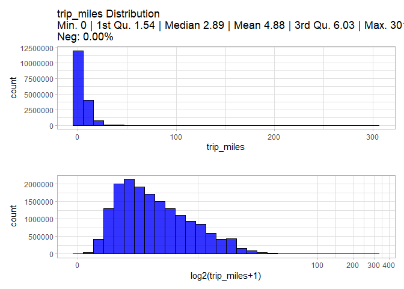

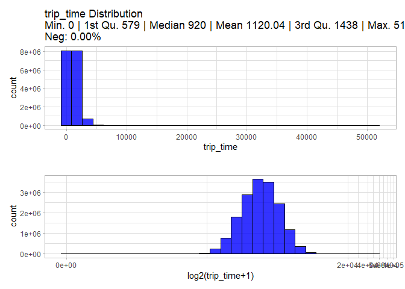


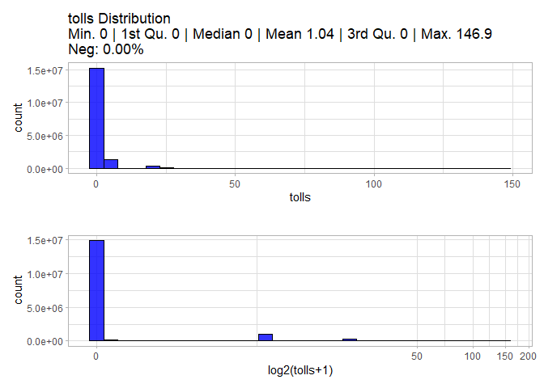

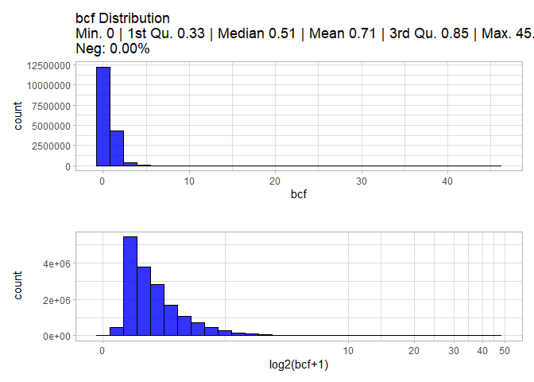

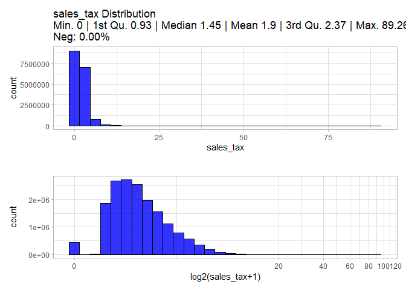

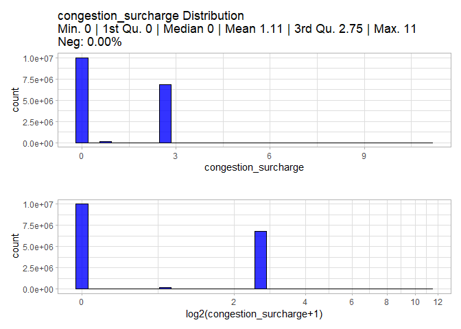

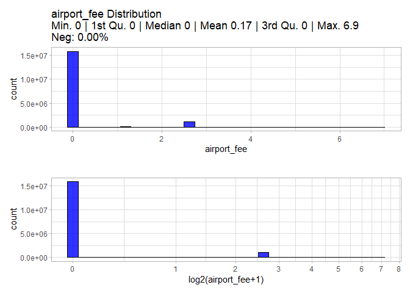

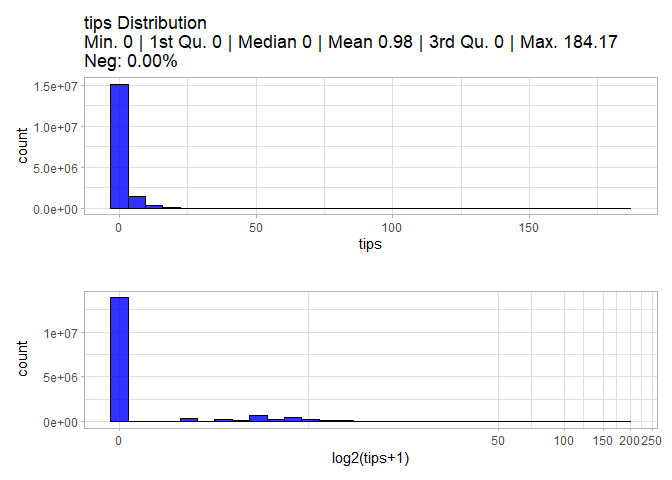

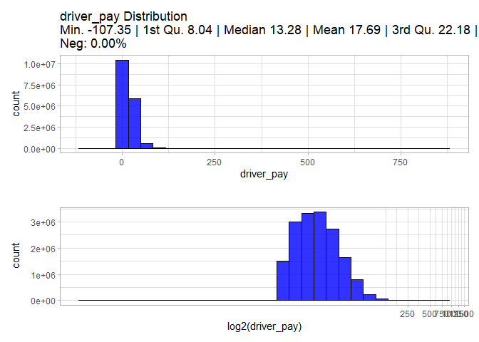

#### Findings

After exploring the histogram of each variable, we found that:

- **3,045** trips have 0 miles, which doesn’t make much sense unless the
  that the trip started and ended at the same location, otherwise these
  values should be label as `NA`.

### Datetime Variables Distribution

To validate numeric variables we are potting at normal and logarithmic
scale.

``` r
date_vars <- TripDataTrain[, names(.SD), .SDcols = is.POSIXct]

for(date_i in date_vars){
  
  date_hist <-
    ggplot(TripDataTrain, aes(get(date_i)))+
    geom_histogram(fill = "blue",
                   color = "black",
                   alpha = 0.8,
                   bins = 30)+
    labs(title = paste0(date_i, " Distribution"),
         x = date_i)
  
  print(date_hist)
}
```

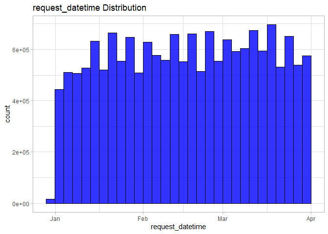

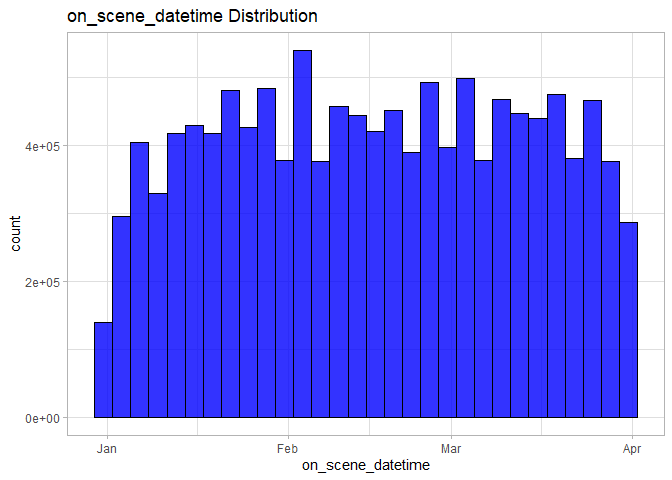

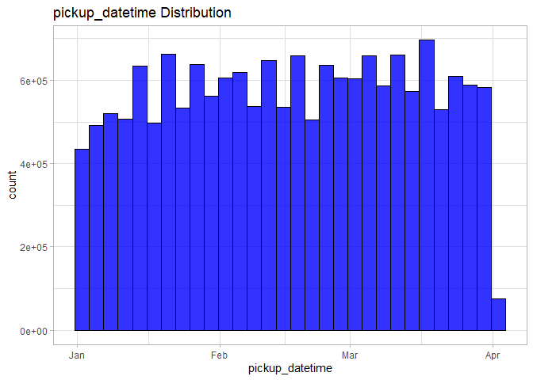

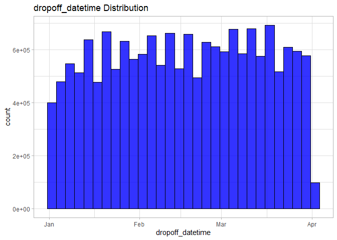

## Domain


``` r
TripDataTrain[trip_miles == 0,
              .N,
              keyby = .(same_service_zone = PU_service_zone == DO_service_zone,
                        same_Borough = PU_Borough == DO_Borough,
                        same_Zone = PU_Zone == DO_Zone)]
```

       same_service_zone same_Borough same_Zone    N
    1:             FALSE        FALSE     FALSE   29
    2:             FALSE         TRUE     FALSE   13
    3:              TRUE        FALSE     FALSE   13
    4:              TRUE         TRUE     FALSE  138
    5:              TRUE         TRUE      TRUE 2852

``` r
TripDataTrain[trip_miles == 0 &
                PU_Zone != DO_Zone &
                ((PU_service_zone != DO_service_zone &
                    PU_Borough == DO_Borough) |
                   (PU_service_zone == DO_service_zone &
                      PU_Borough != DO_Borough)),
              .SD,
              .SDcols = patterns("PU_|DO_")] |>
  View()
```

``` r
library(tidygeocoder)
library(osrm)
library(leaflet)

# Define the locations
data <- data.frame(adress = c("JFK Airport, Queens, NY, US",
                              "Briarwood/Jamaica Hills, Queens, NY, US"))

# Geocode the locations using Nominatim
geo1 <- tidygeocoder::geocode(data, address = "adress", method = "osm")

geo2 <- tidygeocoder::geocode(data, address = "adress", method = "arcgis")

# Calculate the distance
dist2 <- osrm::osrmRoute(src = c(geo2$long[1], geo2$lat[1]), dst = c(geo2$long[2], geo2$lat[2]), overview = "full")

# Print the distance in miles
print(dist2$distance * 0.621371)
```

    [1] 7.939319

``` r
install.packages("leaflet")
```

    Installing leaflet [2.2.0] ...
        OK [linked cache]

``` r
library(leaflet)

# Create a leaflet map
m <- leaflet() |>
  addTiles() |>
  addPolylines(data = dist2$geometry,
               color = "blue")

# Print the map
print(m)
```
