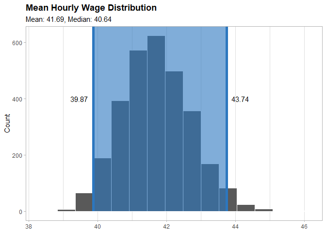

Defining the project
================

- <a href="#project-name" id="toc-project-name">Project Name</a>
- <a href="#problem-statement" id="toc-problem-statement">Problem
  Statement</a>
- <a href="#project-scope" id="toc-project-scope">Project Scope</a>
- <a href="#stakeholders" id="toc-stakeholders">Stakeholders</a>
- <a href="#top-process-definition" id="toc-top-process-definition">Top
  Process Definition</a>
- <a href="#project-objective" id="toc-project-objective">Project
  Objective</a>
- <a href="#defining-metric" id="toc-defining-metric">Defining Metric</a>
- <a href="#data-to-use" id="toc-data-to-use">Data to Use</a>
- <a href="#outcome-to-predict" id="toc-outcome-to-predict">Outcome to
  predict</a>
  - <a href="#defining-metrics-base-line"
    id="toc-defining-metrics-base-line">Defining Metric’s Base Line</a>
- <a href="#business-case" id="toc-business-case">Business Case</a>
- <a href="#projects-side-benefits"
  id="toc-projects-side-benefits">Project’s side benefits</a>
- <a href="#deliverables" id="toc-deliverables">Deliverables</a>

## Project Name

**Taxi Drivers Net Earnings**.

## Problem Statement

The problem is that taxi drivers’ net earnings are not as high as they
could be due to a lack of strategy for increasing tips.

## Project Scope

This project will be limited to Juno, Uber, Via and Lyft taxi drivers
who work in New York City.

## Stakeholders

- Taxi drivers
- Taxi companies
- Customers
- NYC Taxi and Limousine Commission

## Top Process Definition

To define the elements of the process, we use a **SIPOC** diagram.

``` r
DiagrammeR::grViz('
digraph SIPOC {
    rankdir=LR;
    node [shape=box];
    subgraph cluster_S {
        label="Suppliers";
        S1 [label="Gas Station"];
        S2 [label="Car Manufacturer"];
        S3 [label="Taxi Application"];
        S4 [label="Telecomuncation\nCompany"];
        S5 [label="Smartphone Supplier"];
        S6 [label="Maintenance\nService Providers"];
    }
    subgraph cluster_I {
        label="Inputs";
        I1 [label="Gas"];
        I2 [label="Car"];
        I3 [label="Start\nLocation"];
        I4 [label="End\nLocation"];
        I5 [label="Internet"];
        I6 [label="Smartphone"];
        I7 [label="Customer\nRequests"];
    }
    subgraph cluster_P {
        label="Process";
        P1 [label="The customer request a taxi"];
        P2 [label="The driver arrived at\nthe pick-up location"];
        P3 [label="Drivers pick the customer up"];
        P4 [label="Drivers drive to destination"];
        P5 [label="Drivers leave the customer\nat the end point"];
    }
    subgraph cluster_O {
        label="Outputs";
        O1 [label="The customer is picked up\n at start location"];
        O2 [label="The customer recives a\ntravel experience"];
        O3 [label="The Customer gets\nat end location"];
        O4 [label="Payment Received"]
    }
    subgraph cluster_C {
        label="Customers";
        C1 [label="Taxi User"];
    }
    S1 -> I1 [style=invis];
    I1 -> P1 [style=invis];
    P1 -> O1 [style=invis];
    O1 -> C1 [style=invis];
    P1 -> P2 [constraint=false];
    P2 -> P3 [constraint=false];
    P3 -> P4 [constraint=false];
    P4 -> P5 [constraint=false];
}

')
```


## Project Objective

The objective of this project is to develop a strategy to select the
best paid trips possible and to increase their tips and thereby their
net earnings.

## Defining Metric

Based on the current information we can say that our objective is to
increase the **hourly wage** received by each taxi driver defined by the
following formula.

$$
\text{Hourly Wage} = \frac{\text{Total Driver Pay} + \text{Total Tips}}{\text{Total Hours Worked}}
$$

## Data to Use

In this project, we will use a subset of the data available in the [TLC
Trip Record
Data](https://www.nyc.gov/site/tlc/about/tlc-trip-record-data.page) from
2022 to 2023 for **High Volume For-Hire Vehicle** with the columns
described in the README.md file located at the
[data](https://github.com/AngelFelizR/nyc-taxi-project/tree/master/data)
folder.

Based on the variables available, we can divide them in to 2 categories:

- **Available Before Arriving at the Pick-Up Location**: They will be
  used as the predictors to train the model.
  - hvfhs_license_num
  - dispatching_base_num
  - originating_base_num
  - request_datetime
  - PULocationID
  - DOLocationID
  - trip_miles
  - base_passenger_fare
  - shared_request_flag
  - access_a\_ride_flag
  - wav_request_flag
  - wav_match_flag
- **Available After Ending the Trip**: They will be used to create the
  outcome variable needs to be predicted by the model.
  - on_scene_datetime
  - pickup_datetime
  - dropoff_datetime
  - trip_time
  - tolls
  - bcf
  - sales_tax
  - congestion_surcharge
  - airport_fee
  - tips
  - driver_pay
  - shared_match_flag

## Outcome to predict

To select better trips a taxi driver needs to have a clear which are the
best trips to take, I mean the ones the request less time to get more
money.

Based on the available data we can calculate the **profit_rate** in
dollars by minute to *minimize the time needed to make more money* and
increasing in consequence the expected **hourly wage** in the long term.

$$
\text{profit rate} = \frac{\text{driver pay} + \text{tips}}{(\text{dropoff datetime}-\text{request datetime})/60}
$$

### Defining Metric’s Base Line

Defining the baseline based on this data is a challenge as the data
doesn’t have any unique id to make the estimation, but we can run a
simulation to estimate its value with a confident interval.

Let’s start loading the environment to use with zone code related to the
more active borough in NYC (based on EDA).

``` r
# Loading libraries to use
library(here)
library(scales)
library(ggplot2)
library(data.table)
library(lubridate)
library(dplyr)
library(arrow)
library(infer)
source(here("R/01-custom-functions.R"))

# Loading valid zones
ValidZoneCodes <- fread(
  here("data/taxi_zone_lookup.csv"),
  colClasses = c("integer",
                 "character",
                 "character",
                 "character")
)[Borough %chin% c("Manhattan", "Brooklyn", "Queens")]

# Trip Data
NycTrips <- open_dataset(here("data/trip-data"))
```

Then we can define the closest zone to each starting zone.

``` r
ClosestZone <-
  NycTrips |>
  group_by(PULocationID, DOLocationID) |>
  summarize(trip_miles_mean = mean(trip_miles)) |>
  collect() |>
  as.data.table() |>
  (\(dt) dt[PULocationID != DOLocationID
  ][order(PULocationID, trip_miles_mean),
    .SD[1L],
    by = "PULocationID"
  ][, setattr(DOLocationID, "names", PULocationID)])()
```

And identify all zones related to each Borough.

``` r
BoroughZones <-
  ValidZoneCodes[, .(LocationID,
                     id_list = list(LocationID)),
                 by = "Borough"]
```

The simulation will be based on the following assumptions related to the
taxi drivers:

- They can start to work from any zone of Manhattan, Brooklyn or Queens.
- They work from 8 to 12 hour every day.
- They can start to work in any month, weekday or hour.
- They just can take trips starting at the same zone they are after
  ending the their last trip
- The maximum waiting time before receiving a new trip request is 6
  minutes.
- If a taxi driver cannot find a new trip in the first 6 minutes, he can
  to extend 6 minutes more and drive to the closest zone to find a new
  trip, but if that doesn’t work in the next 6 minutes he can drive to
  any zone in the current Borough.

``` r
# Repeating the experiment to create confident intervals
NumRepetitions <- 30L
MinutesToNextTrip <- minutes(6L)

# Defining the seed
set.seed(1558)

# Defining the starting point of each repetition
RandomStartPoint <- data.table(
  simulation_day = 1:NumRepetitions,
  seed_num = sample(1000:9000, NumRepetitions),
  PULocationID = sample(ValidZoneCodes$LocationID, NumRepetitions, replace = TRUE),
  hours_to_work = sample(8:12, NumRepetitions, replace = TRUE),
  start_time = make_datetime(
    year = 2022L,
    month = sample(1:12, NumRepetitions, replace = TRUE),
    day = sample(1:31, NumRepetitions, replace = TRUE),
    hour = sample(0:23, NumRepetitions, replace = TRUE)
  )
)

# Performing base line simulation
BaseLineSimulation <-
  RandomStartPoint[
    , simulate_trips(NycTrips,
                     current_time = start_time,
                     current_zone = PULocationID,
                     minutes_next_trip = MinutesToNextTrip,
                     waiting_time = start_time + MinutesToNextTrip,
                     end_time = start_time + hours(hours_to_work),
                     valid_zones = ValidZoneCodes$LocationID,
                     closest_zone = ClosestZone,
                     borough_zones = BoroughZones,
                     seed_num = seed_num),
    by = "simulation_day"
  ][RandomStartPoint, on = "simulation_day"]
```

After simulating 30 days, we can use **bootstrap** to infer the
distribution of the mean **Hourly Wage** for any day in the year by
following the next steps.

1.  Calculate the *Hourly Wage* for each simulated day.

``` r
SimulationHourlyWage <-
  BaseLineSimulation[, .(`Driver Pay` = sum(s_driver_pay),
                         `Tips` = sum(s_tips),
                         `Hours Worked` = 
                           difftime(max(s_dropoff_datetime),
                                    min(s_request_datetime),
                                    units = "hours") |>
                           as.double()),
                     by = "simulation_day"]

SimulationHourlyWage[, `Hourly Wage` := (`Driver Pay` + Tips) / `Hours Worked`]

SimulationHourlyWage[order(-`Hourly Wage`)]
```

        simulation_day Driver Pay  Tips Hours Worked Hourly Wage
                 <int>      <num> <num>        <num>       <num>
     1:             27     561.86 48.95    10.459722    58.39639
     2:             17     431.23 46.57     9.191667    51.98187
     3:              2     541.88 17.76    10.981111    50.96388
     4:              1     544.42 30.39    12.515833    45.92663
     5:             10     352.58 22.78     8.190278    45.82995
     6:              7     516.20 35.16    12.165000    45.32347
     7:             28     537.79 11.14    12.305556    44.60831
     8:             14     396.48 32.44     9.629444    44.54255
     9:             24     504.33 36.87    12.199444    44.36268
    10:             21     447.45  5.00    10.373889    43.61431
    11:             23     501.49  4.00    11.646944    43.40108
    12:              9     418.95  3.69     9.926667    42.57623
    13:              3     319.96 19.54     7.982778    42.52906
    14:             22     403.93 28.06    10.368056    41.66548
    15:             15     367.57 38.04     9.916111    40.90414
    16:             25     390.68 24.16    10.274722    40.37481
    17:             19     386.10 21.64    10.123056    40.27835
    18:              8     449.98 35.46    12.135000    40.00330
    19:             11     369.39 26.23     9.952222    39.75193
    20:             18     347.86 12.40     9.275000    38.84205
    21:             20     289.18 28.93     8.205833    38.76632
    22:             13     443.58 21.42    12.025000    38.66944
    23:             26     362.86 27.25    10.330556    37.76273
    24:             29     328.65  5.51     8.976389    37.22655
    25:              6     359.90 12.00    10.002222    37.18174
    26:             16     396.42 25.83    11.375556    37.11907
    27:              4     352.79  4.00    10.151111    35.14788
    28:             12     280.80  6.73     8.183611    35.13486
    29:              5     391.17 25.81    12.001111    34.74512
    30:             30     296.46  3.00     9.040278    33.12509
        simulation_day Driver Pay  Tips Hours Worked Hourly Wage

2.  Then we need to resample with replacement a new 30 days hourly wage
    3,000 times and calculate the mean of each resample.

``` r
set.seed(1586)
BootstrapHourlyWage <-
  specify(SimulationHourlyWage,
          `Hourly Wage` ~ NULL) |>
  generate(reps = 3000, type = "bootstrap") |>
  calculate(stat = "mean")

BootstrapHourlyWage
```

    Response: Hourly Wage (numeric)
    # A tibble: 3,000 × 2
       replicate  stat
           <int> <dbl>
     1         1  42.9
     2         2  39.9
     3         3  41.6
     4         4  43.7
     5         5  40.5
     6         6  40.8
     7         7  41.1
     8         8  42.9
     9         9  41.3
    10        10  40.5
    # ℹ 2,990 more rows

3.  Compute the 95% confident interval.

``` r
BootstrapInterval <- 
  get_ci(BootstrapHourlyWage, 
         level = 0.95,
         type = "percentile")

BootstrapInterval
```

    # A tibble: 1 × 2
      lower_ci upper_ci
         <dbl>    <dbl>
    1     39.9     43.7

4.  Visualize the estimated distribution.

``` r
visualize(BootstrapHourlyWage)+
  shade_ci(endpoints = BootstrapInterval,
           color = "#2c77BF",
           fill = "#2c77BF")+
  annotate(geom = "text",
           y = 400,
           x = c(BootstrapInterval[1L][[1L]] - 0.4,
                 BootstrapInterval[2L][[1L]] + 0.4),
           label = unlist(BootstrapInterval) |> comma(accuracy = 0.01))+
  labs(title = "Mean Hourly Wage Distribution",
       subtitle = paste0("Mean: ", round(mean(SimulationHourlyWage$`Hourly Wage`), 2),
                         ", Median: ", round(median(SimulationHourlyWage$`Hourly Wage`), 2)),
       y = "Count")+
  theme_light()+
  theme(panel.grid.minor.y = element_blank(),
        panel.grid.major.y = element_blank(),
        plot.title = element_text(face = "bold"),
        axis.title.x = element_blank())
```



## Business Case

As the base driver’s pay increases with costs like gas, time and car’s
maintenance the best way to increase total earning is by increasing the
amount of **tips** that drivers receive from customers.

Based on *212,416,083* trips recorded 2022, drivers received
*\$229,936,965* in tips which is only 5% of the total earnings for that
year, for example if a driver improves his strategy to increase his tips
to **20%** of his current earning he could be earning **\$1,334.08 extra
monthly** if he works 8 hours a day, 5 days each week and earns
*\$41.69* hourly.

``` r
# 2022 Earning Summary
NycTrips |>
  filter(year == 2022) |>
  summarize(number_of_trips = sum(driver_pay > -1e6),
            trips_with_tips = sum(tips > 0, na.rm = TRUE),
            driver_net_earning = sum(driver_pay + tips, na.rm = TRUE),
            tips = sum(tips, na.rm = TRUE)) |>
  collect() |>
  as.data.table() |>
  (\(dt)  dt[, .(number_of_trips = comma(number_of_trips),
                 trips_with_tips = comma(trips_with_tips),
                 trips_with_tips_pct = percent(trips_with_tips / number_of_trips),
                 driver_net_earning = dollar(driver_net_earning),
                 tips = dollar(tips),
                 tips_pct = percent(tips/driver_net_earning))
          ][, melt(.SD, 
                   measure.vars = names(.SD),
                   variable.name = "Summary Variable",
                   value.name = "Total",
                   variable.factor = FALSE)]
   )()
```

          Summary Variable          Total
                    <char>         <char>
    1:     number_of_trips    212,416,083
    2:     trips_with_tips     42,358,143
    3: trips_with_tips_pct            20%
    4:  driver_net_earning $4,196,894,683
    5:                tips   $229,936,965
    6:            tips_pct             5%

## Project’s side benefits

It’s also important to consider that Taxi companies and customers can
both benefit from drivers earning more tips in several ways:

1.  **Taxi Companies**:
    - **Employee Satisfaction**: Higher tips can lead to increased job
      satisfaction among drivers, which can improve their performance
      and reduce turnover rates.
    - **Company Reputation**: If drivers are earning more tips, it could
      indicate that they are providing excellent service, which can
      enhance the company’s reputation.
    - **Customer Retention**: Satisfied drivers are more likely to
      provide better customer service, which can lead to higher customer
      retention rates.
2.  **Customers**:
    - **Better Service**: Drivers who earn more tips are often those who
      provide better service. This could mean cleaner vehicles, more
      courteous behavior, and a more enjoyable ride overall.
    - **Driver Availability**: If the tip earnings are high, it could
      attract more drivers to work, potentially reducing wait times for
      customers.
    - **Safety**: Drivers who are not worried about their earnings might
      be less likely to engage in risky behaviors (like speeding or
      working overly long shifts) to earn more.

## Deliverables

A **Shiny app** which assists the drivers in focusing their attention on
the better trips.
