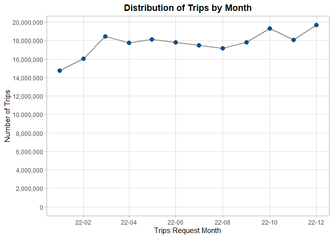
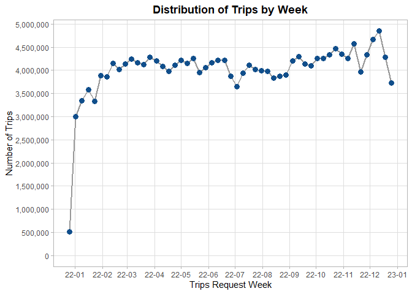

Exploratory Data Analysis (EDA) of 2022 High Volume For-Hire Vehicles
================

- <a href="#setting-the-environment-up"
  id="toc-setting-the-environment-up">Setting the environment up</a>
- <a href="#exploring-distribution-of-each-individual-variable"
  id="toc-exploring-distribution-of-each-individual-variable">Exploring
  distribution of each individual variable</a>
  - <a href="#categorical-variables"
    id="toc-categorical-variables">Categorical variables</a>
  - <a href="#time-variables" id="toc-time-variables">Time variables</a>
  - <a href="#numerical-variables" id="toc-numerical-variables">Numerical
    variables</a>

After completing the [business
understanding](https://github.com/AngelFelizR/nyc-taxi-project/tree/master/notebooks/02-business-understanding)
step, we have a clear objective in mind and an initial description for
each column the [raw
data](https://github.com/AngelFelizR/nyc-taxi-project/tree/master/data),
we are ready to perform the *data understanding* by performing an EDA
with the following steps:

1.  Examining the distribution of each individual variable by counting
    the categorical variables and creating histograms or box plots for
    numerical variables
2.  Defining the target variable and confirming its distribution
3.  Confirming domain knowledge relations by creating visualization with
    2 or more variables
4.  Taking a subset of the data to fit in RAM
5.  Exploring correlations between predictors by using a correlation
    matrix or running a PCA
6.  Removing high correlated predictors
7.  Exploring correlations between the target and predictors creating a
    correlation funnel and some scatter plots.

After completing this process, we will have the following outcomes:

- Confirming the meaning of each variable
- Ensuring data quality by finding missing values and
- Identifying the best models to train
- Creating new features that can enhance the predictive power of the
  machine learning model

## Setting the environment up

To setting the `R` environment up we just need to apply the following 4
steps:

1.  Loading the packages to use.

``` r
library(here)
library(data.table)
library(ggplot2)
library(scales)
library(forcats)
library(lubridate)
library(dplyr)
library(arrow)
```

2.  Sourcing the following custom functions to avoid repeating myself:

- `glimpse`: Adding a fast method to print the basic structure of an
  `arrow_dplyr_query` object.
- `count_pct`: It counts the number rows where each unique value
  repeated in the columns selected arranging there results in descent
  order and adds a percentage column after collecting the results from
  `arrow`.
- `join_zones`: It creates the `start_borough`, `start_zone` and
  `start_service_zone` columns based on the `PULocationID` column and
  the `end_borough`, `end_zone` and `end_service_zone` columns based on
  the `DOLocationID` column.

``` r
source(here("R/01-custom-functions.R"))
```

3.  Creating an Arrow connection object to perform some manipulations in
    disk before taking the data into the RAM memory.

``` r
NycTrips2022 <- 
  here("data/trip-data/year=2022") |>
  open_dataset() |>
  mutate(company = case_when(
    hvfhs_license_num == "HV0002" ~ "Juno",
    hvfhs_license_num == "HV0003" ~ "Uber",
    hvfhs_license_num == "HV0004" ~ "Via",
    hvfhs_license_num == "HV0005" ~ "Lyft"
  )) |>
  select(-hvfhs_license_num)


glimpse(NycTrips2022)
```

    FileSystemDataset (query)
    212,416,083 rows x 25 columns

    dispatching_base_num: string
    originating_base_num: string
    request_datetime: timestamp[us]
    on_scene_datetime: timestamp[us]
    pickup_datetime: timestamp[us]
    dropoff_datetime: timestamp[us]
    PULocationID: int64
    DOLocationID: int64
    trip_miles: double
    trip_time: int64
    base_passenger_fare: double
    tolls: double
    bcf: double
    sales_tax: double
    congestion_surcharge: double
    airport_fee: double
    tips: double
    driver_pay: double
    shared_request_flag: string
    shared_match_flag: string
    access_a_ride_flag: string
    wav_request_flag: string
    wav_match_flag: string
    month: int32
    company: string

4.  Importing the zone code description.

``` r
ZoneCodes <- fread(
  here("data/taxi_zone_lookup.csv"),
  colClasses = c("integer",
                 "character",
                 "character",
                 "character")
)

glimpse(ZoneCodes)
```

    Rows: 265
    Columns: 4
    $ LocationID   <int> 1, 2, 3, 4, 5, 6, 7, 8, 9, 10, 11, 12, 13, 14, 15, 16, 17…
    $ Borough      <chr> "EWR", "Queens", "Bronx", "Manhattan", "Staten Island", "…
    $ Zone         <chr> "Newark Airport", "Jamaica Bay", "Allerton/Pelham Gardens…
    $ service_zone <chr> "EWR", "Boro Zone", "Boro Zone", "Yellow Zone", "Boro Zon…

5.  Counting the number of trips for each code, collecting and
    translating the zone codes.

``` r
TripsZoneDistribution <-
  NycTrips2022 |>
  count(PULocationID, DOLocationID) |>
  collect() |>
  join_zones(zone_tb = ZoneCodes)

glimpse(TripsZoneDistribution)
```

    Rows: 65,445
    Columns: 7
    $ start_borough      <chr> "Manhattan", "Manhattan", "Manhattan", "Manhattan",…
    $ start_zone         <chr> "Murray Hill", "Upper East Side South", "Yorkville …
    $ start_service_zone <chr> "Yellow Zone", "Yellow Zone", "Yellow Zone", "Yello…
    $ end_borough        <chr> "Manhattan", "Manhattan", "Manhattan", "Manhattan",…
    $ end_zone           <chr> "Midtown Center", "Midtown Center", "Sutton Place/T…
    $ end_service_zone   <chr> "Yellow Zone", "Yellow Zone", "Yellow Zone", "Yello…
    $ n                  <int> 65271, 87040, 18209, 34465, 17883, 11167, 16980, 21…

## Exploring distribution of each individual variable

### Categorical variables

- `company`: The majority number of trips are done by *Uber* (HV003) and
  the rest for *Lyft*.

``` r
NycTrips2022 |> count_pct(company)
```

    # A tibble: 2 × 3
      company         n   pct
      <chr>       <int> <dbl>
    1 Uber    153847310 0.724
    2 Lyft     58568773 0.276

- `dispatching_base_num`: For most of the trips the dispatching number
  is **B03404** for Uber and **B03406** related for Lyft. Uber also has
  other 27 dispatching number, but they are really weird to see.

``` r
NycTrips2022 |>
  count_pct(company, dispatching_base_num) |>
  as.data.table() |>
  (\(dt) dt[, .(n_unique_code = n_distinct(dispatching_base_num),
                n_missing = sum(is.na(dispatching_base_num)),
                n = sum(n),
                pct = sum(pct) |> round(4L)),
            by = .(company,
                   common = pct > 0.01)
          ][order(-n)] )()
```

       company common n_unique_code n_missing         n    pct
    1:    Uber   TRUE             1         0 153732577 0.7237
    2:    Lyft   TRUE             1         0  58568773 0.2757
    3:    Uber  FALSE            27         0    114733 0.0005

- `originating_base_num`: This column has the same information as
  `dispatching_base_num` or has missing values, so we don’t need to use
  it.

``` r
NycTrips2022 |>
  count_pct(company,
            same_id = originating_base_num == dispatching_base_num)
```

    # A tibble: 5 × 4
      company same_id         n        pct
      <chr>   <lgl>       <int>      <dbl>
    1 Uber    TRUE    153844893 0.724     
    2 Lyft    NA       58497292 0.275     
    3 Lyft    TRUE        71481 0.000337  
    4 Uber    NA           1432 0.00000674
    5 Uber    FALSE         985 0.00000464

- `shared_request_flag`: Most of passengers don’t agree to a
  shared/pooled ride.

``` r
NycTrips2022 |> count_pct(shared_request_flag)
```

    # A tibble: 2 × 3
      shared_request_flag         n     pct
      <chr>                   <int>   <dbl>
    1 N                   210564721 0.991  
    2 Y                     1851362 0.00872

- `shared_match_flag`: From the subset of trips that agreed to share the
  ride only 24% achieved the match, we even can see some weird cases
  when the passenger did not initially agree to a shared/pooled ride
  (shared_request_flag = N), but ended up sharing the vehicle with
  another passenger who booked separately at some point during the trip
  (shared_match_flag = Y).

``` r
NycTrips2022 |> 
  count(shared_request_flag, shared_match_flag) |>
  collect() |>
  group_by(shared_request_flag) |>
  mutate(pct = n / sum(n)) |>
  arrange(desc(shared_request_flag), desc(shared_match_flag))
```

    # A tibble: 4 × 4
    # Groups:   shared_request_flag [2]
      shared_request_flag shared_match_flag         n      pct
      <chr>               <chr>                 <int>    <dbl>
    1 Y                   Y                    452035 0.244   
    2 Y                   N                   1399327 0.756   
    3 N                   Y                     47973 0.000228
    4 N                   N                 210516748 1.00    

- `access_a_ride_flag`: *Uber* isn’t reporting whether their trips were
  administered on behalf of the Metropolitan Transportation Authority
  and for *Lyft* the answer is always “N”, so we will **erase** this
  column as it doesn’t show any useful information.

``` r
NycTrips2022 |> count_pct(company, access_a_ride_flag)
```

    # A tibble: 2 × 4
      company access_a_ride_flag         n   pct
      <chr>   <chr>                  <int> <dbl>
    1 Uber    " "                153847310 0.724
    2 Lyft    "N"                 58568773 0.276

- `wav_request_flag`: It’s really unusual for a passenger to request a
  wheelchair-accessible vehicle.

``` r
NycTrips2022 |> count_pct(wav_request_flag)
```

    # A tibble: 2 × 3
      wav_request_flag         n     pct
      <chr>                <int>   <dbl>
    1 N                212142808 0.999  
    2 Y                   273275 0.00129

- `wav_match_flag`: If someone ask for a wheelchair-accessible vehicle
  it’s really often that passenger get that type of vehicle.

``` r
NycTrips2022 |> 
  count(wav_request_flag, wav_match_flag) |>
  collect() |>
  group_by(wav_request_flag) |>
  mutate(pct = n / sum(n)) |>
  arrange(desc(wav_request_flag), desc(wav_match_flag))
```

    # A tibble: 4 × 4
    # Groups:   wav_request_flag [2]
      wav_request_flag wav_match_flag         n    pct
      <chr>            <chr>              <int>  <dbl>
    1 Y                Y                 266935 0.977 
    2 Y                N                   6340 0.0232
    3 N                Y               12369744 0.0583
    4 N                N              199773064 0.942 

- `start_borough` and `end_borough`: After exploring the next
  distribution of trips we can highlight that:

  - 94% of the trips take place in *Manhattan*, *Brooklyn*, *Queens* and
    *Bronx*. As consequence, there is no reason to keep exploring trips
    related to *Staten Island*, *EWR* or *Unknown* as they are the
    minority.
  - 70% the trips take place without going to outside the start borough.

``` r
TripsZoneDistribution[, .(n = sum(n)),
                      by = c("start_borough", "end_borough")
][order(n)
][, c("start_borough", "end_borough") := 
    lapply(.SD, \(x) factor(x, levels = unique(x, fromLast = TRUE)) ),
  .SDcols = c("start_borough", "end_borough")
][, end_borough := fct_rev(end_borough)] |>
  ggplot(aes(end_borough, start_borough))+
  geom_tile(aes(fill = n)) +
  geom_text(aes(label = percent(n/sum(n), accuracy = 0.01))) +
  scale_fill_gradient(low = "white", 
                      high = "red",
                      labels= comma_format())+
  scale_x_discrete(position = "top") +
  labs(title = "Distribution of Trips by Borough in NYC 2022",
       x = "Trip End", 
       y = "Trip Start", 
       fill = "Number of Trips") +
  theme_classic() +
  theme(plot.title = element_text(face = "bold"),
        axis.ticks = element_blank(),
        axis.line = element_blank(),
        axis.text = element_text(color = "black"),
        axis.title = element_text(face = "italic"))
```


- `start_service_zone` and `end_service_zone`: 52% of the trips take
  place at the *Boro Zone*, 26% of trips take place at the *Yellow Zone*
  and only small fraction goes to the *Airports*.

``` r
TripsZoneDistribution[  
  !start_borough %chin% c("Staten Island", "Unknown", "EWR") &
    !end_borough %chin% c("Staten Island", "Unknown", "EWR"), 
  .(n = sum(n)),
  by = c("start_service_zone",
         "end_service_zone")
][order(n)
][, c("start_service_zone", "end_service_zone") := 
    lapply(.SD, \(x) factor(x, levels = unique(x, fromLast = TRUE)) ),
  .SDcols = c("start_service_zone", "end_service_zone")
][, end_service_zone := fct_rev(end_service_zone)] |>
  ggplot(aes(end_service_zone, start_service_zone))+
  geom_tile(aes(fill = n)) +
  geom_text(aes(label = percent(n/sum(n), accuracy = 0.01))) +
  scale_fill_gradient(low = "white", 
                      high = "red",
                      labels= comma_format())+
  scale_x_discrete(position = "top") +
  labs(title = "Distribution of Trips by Service Zone in NYC 2022",
       x = "Trip End", 
       y = "Trip Start", 
       fill = "Number of Trips") +
  theme_classic() +
  theme(plot.title = element_text(face = "bold"),
        axis.ticks = element_blank(),
        axis.line = element_blank(),
        axis.text = element_text(color = "black"),
        axis.title = element_text(face = "italic"))
```


- `start_zone` and `end_zone`: As our data has 55,559 rows of relations
  between both columns, we opted to transform data in a way what each
  unique zone represent a row reducing the points to be plotted to only
  238 by following the next steps:

  1.  Summarizing the total number of trips for each **starting point**
      independently to its destination
  2.  Summarizing the total number of trips for each **ending point**
      independently to its origin.
  3.  Joining both tables into one.

``` r
# 1. Summarizing Staring Zones
StartingZonesCount <-
  TripsZoneDistribution[
    !start_borough %chin% c("Staten Island", "Unknown", "EWR") &
      !end_borough %chin% c("Staten Island", "Unknown", "EWR"),
    .(start_trips = sum(n)),
    by =  .(borough = start_borough, 
            zone = start_zone)
  ]

# 2. Summarizing Ending Zones
EndingZonesCount <-
  TripsZoneDistribution[
    !start_borough %chin% c("Staten Island", "Unknown", "EWR") &
      !end_borough %chin% c("Staten Island", "Unknown", "EWR"), 
    .(end_trips = sum(n)),
    by =  .(borough = end_borough, 
            zone = end_zone)
  ]

# 3. Inner Joining Starting and Ending Zones Counts
JoinedZonesCount <-
  StartingZonesCount[
    EndingZonesCount,
    on = c("borough", "zone"),
    nomatch = 0
  ]
```

Once we have a much simpler data to work with, we is easy to confirm
with the next linear regression that `start_trips` and `end_trips` has
almost the same values the model has an slope of one. That means that in
must of cases **if someone takes a taxi to go to any place it’s really
likely to take another taxi back**.

``` r
lm(end_trips ~ start_trips, 
   data = JoinedZonesCount) |>
  summary()
```


    Call:
    lm(formula = end_trips ~ start_trips, data = JoinedZonesCount)

    Residuals:
        Min      1Q  Median      3Q     Max 
    -428723  -34008    9811   26938 1315702 

    Coefficients:
                  Estimate Std. Error t value Pr(>|t|)    
    (Intercept) -2.274e+04  1.321e+04  -1.722   0.0864 .  
    start_trips  1.027e+00  1.231e-02  83.465   <2e-16 ***
    ---
    Signif. codes:  0 '***' 0.001 '**' 0.01 '*' 0.05 '.' 0.1 ' ' 1

    Residual standard error: 127400 on 236 degrees of freedom
    Multiple R-squared:  0.9672,    Adjusted R-squared:  0.9671 
    F-statistic:  6966 on 1 and 236 DF,  p-value: < 2.2e-16

Let’s now explore the zones where there is **no balance** between the
`start_trips` and the `end_trips` in the most visited zoned of each
Borough. To do so, we defined the rate `end_trips`/`start_trips` and
highlight zones with lower rate than the 15% percentile or higher rate
than 85% percentile.

``` r
# Creating dataset to plot
ZonesCountToPlot <-
  copy(JoinedZonesCount)[
    j = `:=`(ending_starting_rate = end_trips/start_trips,
             borough = fct_reorder(borough, -end_trips, .fun = sum, na.rm = TRUE),
             end_m_trips = end_trips / 1e6L,
             start_m_trips = start_trips / 1e6L)
  ][, unbalance_situation := fcase(
    ending_starting_rate < quantile(ending_starting_rate, 0.15),
    "More starts than ends",
    ending_starting_rate > quantile(ending_starting_rate, 0.85),
    "More ends than starts",
    default = "Balanced"
  )
  ][order(-(start_trips + end_trips)), 
    .SD[1:6],
    by = "borough"] 

# Creating the scatted plot
ggplot(ZonesCountToPlot,
       aes(start_m_trips, end_m_trips))+
  geom_blank(aes(pmax(start_m_trips, end_m_trips),
                 pmax(start_m_trips, end_m_trips)))+
  geom_abline(linewidth = 0.8,
              alpha = 0.5)+
  geom_point(aes(color = borough),
             size = 3.5,
             alpha = 0.75)+
  geom_text(data = ZonesCountToPlot[unbalance_situation ==
                                      "More starts than ends"],
            aes(label = zone),
            size = 3.5,
            hjust = -0.12,
            check_overlap = TRUE)+
  geom_text(data = ZonesCountToPlot[unbalance_situation ==
                                      "More ends than starts"],
            aes(label = zone),
            size = 3.5,
            hjust = 1.12,
            check_overlap = TRUE)+
  scale_x_continuous(labels = comma_format(accuracy = 0.1, suffix = " M"))+
  scale_y_continuous(labels = comma_format(accuracy = 0.1, suffix = " M"))+
  coord_equal() +
  labs(title = "Top 6 Most Important Zones by Borough",
       color = "Borough",
       x = "Number of Trips Starting",
       y = "Number of Trips Ending")+
  theme_light()+
  theme(legend.position = "top",
        text = element_text(color = "black"),
        plot.title = element_text(face = "bold"))
```


Based on the results, we can highlight the next points:

1.  The airports present in Queens, *LaGuardia Airport* and *JFK
    Airport*, have many more trips going to the airport than going out
    of airport. This might happen due that there are more transportation
    options like other taxis, shuttles, and public transportation.

2.  The remaining zones, *Jackson Heights*, *East Village* and
    *TriBeCa/Civic Center*, are residential zones with a variety of
    public transportation options.

### Time variables

In our data the columns `request_datetime`, `on_scene_datetime`,
`pickup_datetime`, `dropoff_datetime` and `month` are time related and
as taxi trips takes less than a day most of the columns well be highly
correlated. To explore the data efficiently we will explore the
distribution of `request_datetime`and then use columns to calculate the
time required for each process described in the **SIPOC** diagram.

#### Exploring the Customer Request distribution

To describe this variable, we decomposed it in different parts and count
the number trips by each element and store the summary as a `data.table`
to explore each part using visualizations.

``` r
RequestTimeSummary <-
  NycTrips2022 |>
  transmute(parquet_month = make_date(2022L, month),
            request_datetime,
            request_date = as_date(request_datetime)) |>
  count(parquet_month,
        request_month = floor_date(request_date, unit = "month"),
        request_week = floor_date(request_date, unit = "week"),
        request_day = day(request_date),
        request_hour = hour(request_datetime),
        request_weekday = wday(request_date, week_start = 1)) |>
  collect() |>
  as.data.table()
```

- `month`: As we can see below most the months related to parquet files
  match with the request, as consequence there is no reason to keep that
  variable.

``` r
RequestTimeSummary[, .(n = sum(n)),
                   by = c("parquet_month", "request_month")] |>
  ggplot(aes(request_month, parquet_month))+
  geom_abline(color = "grey60",
              linewidth = 1.1)+
  geom_point(aes(size = n),
             color = "dodgerblue4")+
  scale_x_date(date_labels = "%y-%m",
               date_breaks = "2 months")+
  scale_y_date(date_labels = "%y-%m",
               date_breaks = "months")+
  scale_size_continuous(labels = comma_format(),
                        breaks = c(5e3, 1.5e7))+
  labs(title = "Comparting Request and Parquet File Months",
       x = "Trips Request Month",
       y = "Trips per Parquet File",
       size = "Number of Trips")+
  coord_equal()+
  theme_light()+
  theme(plot.title = element_text(face = "bold", hjust = 0.5),
        panel.grid.minor = element_blank(),
        legend.position = "top")
```


In the next chart, we can see that the number trips keeps almost
constant must of the year, but we have some fewer trips during the first
2 months and some extra trips in October and December.

``` r
RequestTimeSummary[year(request_month) == 2022, 
                   .(n = sum(n)),
                   by = "request_month"] |>
  ggplot(aes(request_month, n))+
  geom_line(color = "grey60",
            linewidth = 0.9)+
  geom_point(color = "dodgerblue4",
             size = 3)+
  scale_x_date(date_labels = "%y-%m",
               date_breaks = "2 months")+
  scale_y_continuous(labels = comma_format(),
                     breaks = breaks_width(2e6))+
  labs(title = "Distribution of Trips by Month",
       x = "Trips Request Month",
       y = "Number of Trips")+
  expand_limits(y = 0)+
  theme_light()+
  theme(plot.title = element_text(face = "bold", hjust = 0.5),
        panel.grid.minor = element_blank(),
        legend.position = "top")
```


By breaking the months into weeks we can confirm we have fewer trips in
the first 2 months, in relation to October we don’t see a big change in
he number of trips we see is that it has more weeks than November, but
December keeps having more trips than normal in the first 2 weeks.

``` r
RequestTimeSummary[year(request_month) == 2022, 
                   .(n = sum(n)),
                   by = "request_week"] |>
  ggplot(aes(request_week, n))+
  geom_line(color = "grey60",
            linewidth = 0.9)+
  geom_point(color = "dodgerblue4",
             size = 3)+
  scale_x_date(date_labels = "%y-%m",
               date_breaks = "month")+
  scale_y_continuous(labels = comma_format(),
                     breaks = breaks_width(5e5))+
  labs(title = "Distribution of Trips by Week",
       x = "Trips Request Week",
       y = "Number of Trips")+
  expand_limits(y = 0)+
  theme_light()+
  theme(plot.title = element_text(face = "bold", hjust = 0.5),
        panel.grid.minor = element_blank(),
        legend.position = "top")
```



I the next chart we can see how the higher number of trips take place
Friday and Saturdays from 17:00 to 00:00 of next days with totals over
1.8 milions trips.

``` r
weekdays_name <- c("Mo", "Tu", "We", "Th", "Fr", "Sa", "Su")

RequestTimeSummary[year(request_month) == 2022, 
                   .(n = sum(n)),
                   by = .(request_hour = 
                            factor(request_hour) |> fct_rev(), 
                          request_weekday =
                            factor(weekdays_name[request_weekday], 
                                   levels = weekdays_name))
  ][, n_million := n/1e6 ] |>
  ggplot(aes(request_weekday, request_hour))+
  geom_tile(aes(fill = n),
            color = "black",
            linewidth = 0.005)+
  geom_text(aes(label = comma(n_million, accuracy = 0.1, suffix = " M")))+
  scale_fill_gradient(low = "white", 
                      high = "dodgerblue4",
                      labels= comma_format())+
  labs(title = "Number of Trips by Hour and Week Day",
       fill = "Number of Trips",
       x = "Request Week Day",
       y = "Request Hour") +
  theme_classic() +
  theme(plot.title = element_text(face = "bold"),
        axis.ticks = element_blank(),
        axis.line = element_blank(),
        axis.text = element_text(color = "black"),
        axis.title = element_text(face = "italic"))
```



``` r
compute_sec_diff <- function(x, start_time, end_time){
  
  transmute(x,
            sec_diff = 
              difftime(get(end_time), get(start_time)) |> 
              as.character() |>
              as.double()) |>
    filter(!is.na(sec_diff))
  
}

compute_boxplot <- function(x, value){

    summarize(x,
              min_value = min({{value}}),
              q1 = quantile({{value}}, 0.25),
              q2 = quantile({{value}}, 0.50),
              q3 = quantile({{value}}, 0.75),
              max_value = max({{value}})) |>
    mutate(lower_hinge = q1 - 1.5*(q3 - q1),
           higher_hinge = q3 + 1.5*(q3 - q1))
  
}


time_names <- c(
  "request_datetime",
  "on_scene_datetime", 
  "pickup_datetime",
  "dropoff_datetime"
)

metric_name <- c(
  "sec_to_location",
  "sec_to_start",
  "sec_to_end"
)

# NycTrips2022 |>
#   compute_sec_diff(times_names[i],
#                    times_names[i+1L]) |>
#   compute_boxplot(sec_diff) |>
#   mutate(metric = metric_name[i]) |>
#   collect() |>
#   as.data.table() 
```

### Numerical variables

- `trip_miles`:
- `trip_time`:
- `base_passenger_fare`:
- `tolls`:
- `bcf`:
- `sales_tax`:
- `congestion_surcharge`:
- `airport_fee`:
- `tips`:
- `driver_pay`:
