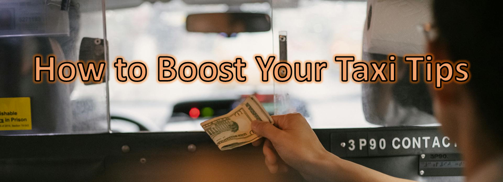

# Key findings:

## Table of Contents

- [Business summary](#business-summary)
  - [Problem description](#problem-description)
  - [Metodology](#metodology)
  - [Results](#results)
  - [Practical recomendations](#practical-recomendations)
  - [Limitation and what can be
    improved](#limitation-and-what%20can-be-improved)
- [Tecnical description](#tecnical-description)
  - [Assuptions made](#assuptions-made)
  - [Stack used](#stack-used)
  - [Folder structure](#folder-structure)
  - [Run localy](#run-localy)
- [References](#references)

## Business summary

### Problem description

According to the *Taxi & Limousine Commission* (TLC) of New York City in
2021 where **174,924 drivers** licensed to make trips in that city. All
drivers are interest in increasing their incomes and one great way to
archive that it’s to **start receiving more tips** from their
passengers.

Let’s explore the [High Volume FHV Trip
Records](https://www.nyc.gov/site/tlc/about/tlc-trip-record-data.page)
provided by the TLC of New York city which contain data related trips
done by app companies like *Uber*, *Via* and *Lyft* to find **what can
be done to increase the changes to receive a tip**.

### Metodology

- 

### Results

### Practical recomendations

### Limitation and what can be improved

- 

## Tecnical description

### Assuptions made

### Stack used

- 

### Folder structure

### Run localy

## References

- *New York City Taxi and Limousine Commission 2021 Annual Report*:
  https://www.nyc.gov/assets/tlc/downloads/pdf/annual_report_2021.pdf

- *Dataset Description*: https://www.nyc.gov/assets/tlc/downloads/pdf/data_dictionary_trip_records_hvfhs.pdf
