# Exploratory Data Analysis

- [Setting the environment up](#setting-the-environment-up)
- [Exploring variable distribution](#exploring-variable-distribution)
  - [Categorical variables
    distribution](#categorical-variables-distribution)
  - [Numerical variables
    distribution](#numerical-variables-distribution)
  - [Datetime variables distribution](#datetime-variables-distribution)
- [References](#references)

## Setting the environment up

1.  Loading main packages

``` r
library(here)
library(data.table)
library(lubridate)
library(ggplot2)
library(scales)
library(forcats)
theme_set(theme_light())

source(here("R/02-custom-functions.R"))
source(here("R/03-custom-values.R"))
```

2.  Importing zone codes

``` r
ZoneCodes <- fread(
  here("data/taxi_zone_lookup.csv"),
  select = ZoneCodesColTypes
)
```

3.  Importing and decoding training data.

``` r
DecodedTrips <- fst::read_fst(
  path = here("data/TripDataTrain.fst"),
  as.data.table = TRUE
) |>
  decode_zones(ZoneCodes) |>
  decode_business()

setnames(DecodedTrips, "bcf","back_car_fund")
```

## Exploring variable distribution

The purpose of this section is to:

- Understand the meaning of each variable and compare results with
  current domain knolege
- Find hidden missing values
- Find usual values

### Categorical variables distribution

- `company`: The majority number of trips are done by *Uber* (HV003) and
  the rest for *Lyft*.

``` r
plot_chr_count(DecodedTrips, "company")
```

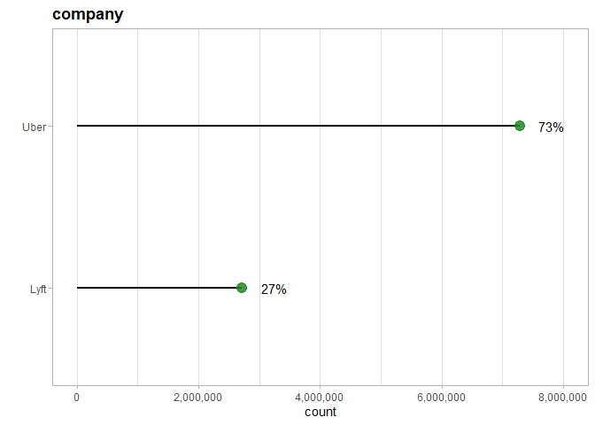

- `dispatching_base_num`: This column doesn’t show much information, so
  we will **erase** this column as it doesn’t show any useful
  information.

``` r
plot_chr_count(DecodedTrips, "dispatching_base_num")
```

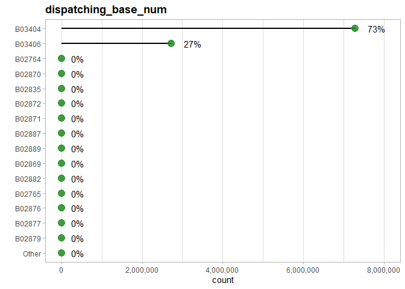

- `originating_base_num`: This column doesn’t show much information, so
  we will **erase** this column as it doesn’t show any useful
  information.

``` r
plot_chr_count(DecodedTrips, "originating_base_num")
```

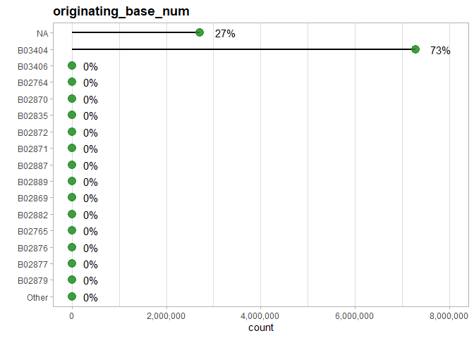

- `shared_request_flag`: Most of passengers don’t agree to a
  shared/pooled ride.

``` r
plot_chr_count(DecodedTrips, "shared_request_flag")
```

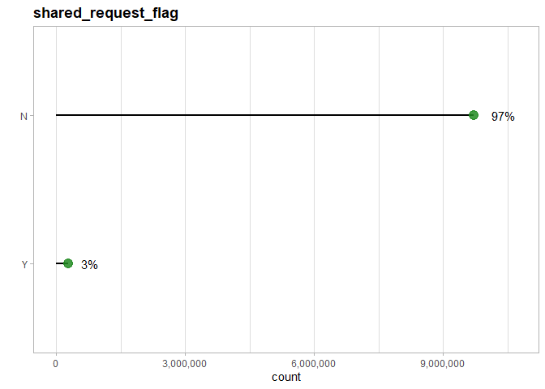

- `shared_match_flag`: Shows that actually fewer trips were shared.

``` r
plot_chr_count(DecodedTrips, "shared_match_flag")
```

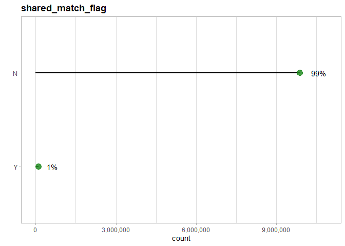

- `access_a_ride_flag`: *Uber* isn’t reporting whether their trips were
  administered on behalf of the Metropolitan Transportation Authority
  and for *Lyft* the answer is always “N”, so we will **erase** this
  column as it doesn’t show any useful information.

``` r
plot_chr_count(DecodedTrips, "access_a_ride_flag")
```

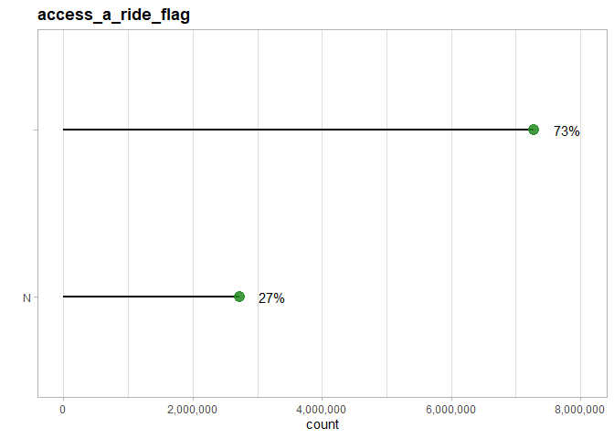

``` r
DecodedTrips[, .N,
              by = c("company",
                     "access_a_ride_flag")]
```

       company access_a_ride_flag       N
    1:    Uber                    7282646
    2:    Lyft                  N 2717354

- `wav_request_flag`: It’s really unusual for a passager to request a
  wheelchair-accessible vehicle.

``` r
plot_chr_count(DecodedTrips, "wav_request_flag")
```

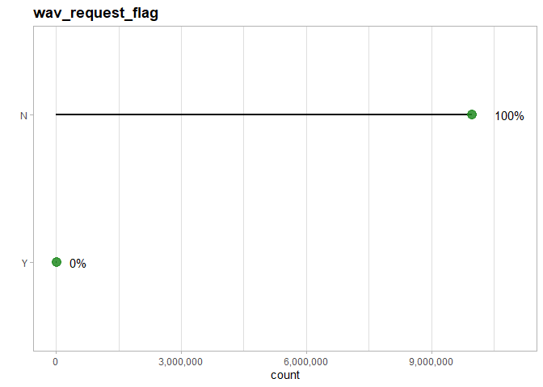

``` r
DecodedTrips[, .N, "wav_request_flag"]
```

       wav_request_flag       N
    1:                N 9984507
    2:                Y   15493

- `wav_match_flag`: 7% of trips took place in wheelchair-accessible
  vehicle which implies that there is more offers than demand.

``` r
plot_chr_count(DecodedTrips, "wav_match_flag")
```

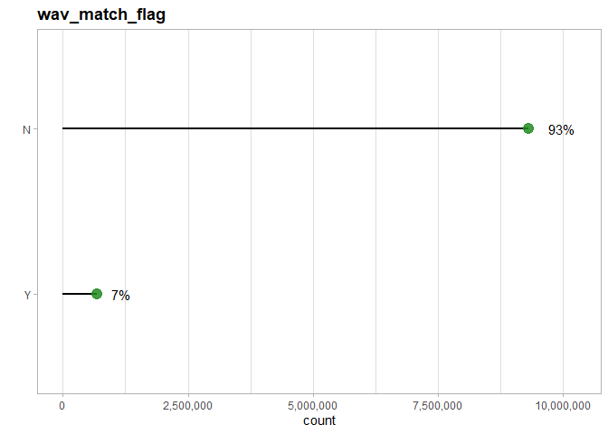

- For `start_Borough` and `end_Borough` it’s weird to start or end the
  trips in Stalen Island or the EWR Airport.

``` r
plot_chr_count(DecodedTrips, 
               count_var = c("start_Borough",
                             "end_Borough"),
               breaks_width = 2e6)
```

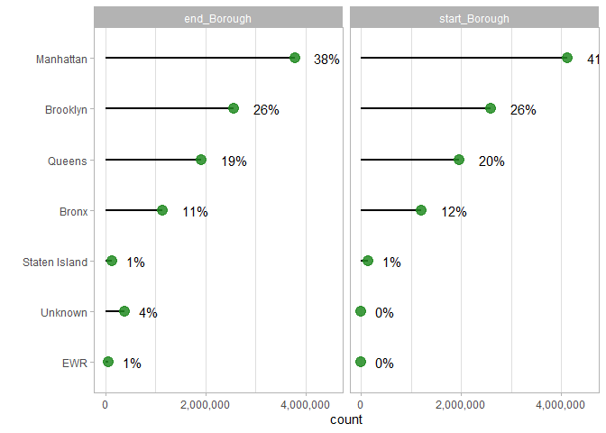

- For `start_service_zone` and `end_service_zone` It’s weird to start or
  end the trips in any Airports. For consistency we will **relabel EWR
  as Airports**.

``` r
plot_chr_count(DecodedTrips, 
               count_var = c("start_service_zone",
                             "end_service_zone"),
               breaks_width = 2e6)
```

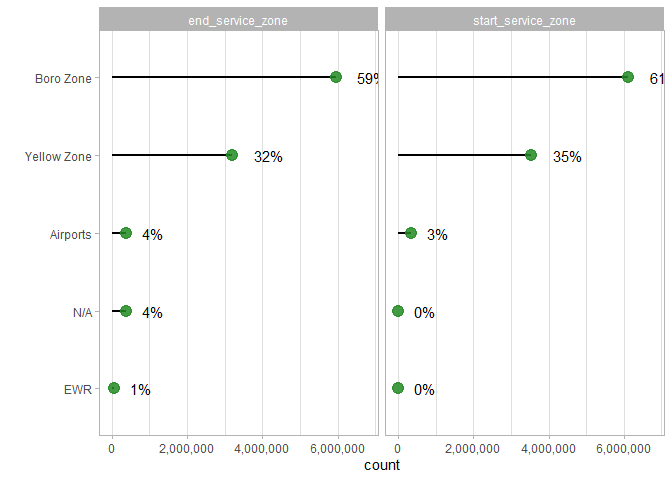

At this point is important to explain that in NYC cabs operate different
depending on its color:

- **Yellow cabs**: They have no restrictions when it comes to travel.

- **Green cabs**: They can only pick up passengers in Harlem (south of
  West 110th St and East 96th St), Queens, the Bronx and Brooklyn —
  excluding the airports but **can drop passengers off anywhere** in New
  York City.

> **Uber** and **Lyft** doesn’t any restriction at traveling.


- `start_Zone` and `end_Zone` represent a diverse number of places as
  theirs higher proportion of trips is lower then 3% with the exception
  of the “N/A” value that needs to be **erased and inputed**.

``` r
plot_chr_count(DecodedTrips, 
               count_var = c("start_Zone",
                             "end_Zone"),
               breaks_width = 3e6,
               wrap_scales = "free_y")
```

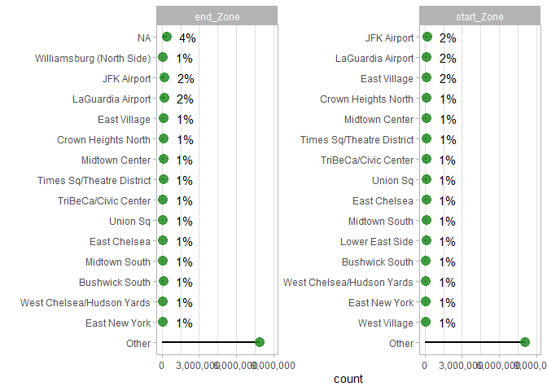

### Numerical variables distribution

Before checking any distribution chart let’s the summary statistics of
numeric vars.

``` r
NumericSummary <-
  DecodedTrips[, .SD, .SDcols = is.numeric] |>
  skimr::skim()
  
NumericSummary
```

|                                                  |                             |
|:-------------------------------------------------|:----------------------------|
| Name                                             | DecodedTrips\[, .SD, .SDco… |
| Number of rows                                   | 10000000                    |
| Number of columns                                | 10                          |
| Key                                              | NULL                        |
| \_\_\_\_\_\_\_\_\_\_\_\_\_\_\_\_\_\_\_\_\_\_\_   |                             |
| Column type frequency:                           |                             |
| numeric                                          | 10                          |
| \_\_\_\_\_\_\_\_\_\_\_\_\_\_\_\_\_\_\_\_\_\_\_\_ |                             |
| Group variables                                  | None                        |

Data summary

**Variable type: numeric**

| skim_variable        | n_missing | complete_rate |    mean |     sd |     p0 |    p25 |    p50 |     p75 |     p100 | hist  |
|:---------------------|----------:|--------------:|--------:|-------:|-------:|-------:|-------:|--------:|---------:|:------|
| trip_miles           |         0 |             1 |    4.88 |   5.67 |   0.00 |   1.54 |   2.89 |    6.03 |   351.17 | ▇▁▁▁▁ |
| trip_time            |         0 |             1 | 1120.47 | 777.34 |   0.00 | 579.00 | 921.00 | 1438.00 | 43024.00 | ▇▁▁▁▁ |
| base_passenger_fare  |         0 |             1 |   22.47 |  18.64 | -69.50 |  10.86 |  17.08 |   27.46 |  1575.43 | ▇▁▁▁▁ |
| tolls                |         0 |             1 |    1.04 |   3.77 |   0.00 |   0.00 |   0.00 |    0.00 |   177.82 | ▇▁▁▁▁ |
| back_car_fund        |         0 |             1 |    0.71 |   0.63 |   0.00 |   0.33 |   0.51 |    0.85 |    64.71 | ▇▁▁▁▁ |
| sales_tax            |         0 |             1 |    1.90 |   1.53 |   0.00 |   0.93 |   1.45 |    2.37 |    97.79 | ▇▁▁▁▁ |
| congestion_surcharge |         0 |             1 |    1.11 |   1.35 |   0.00 |   0.00 |   0.00 |    2.75 |     5.50 | ▇▁▆▁▁ |
| airport_fee          |         0 |             1 |    0.17 |   0.63 |   0.00 |   0.00 |   0.00 |    0.00 |     6.90 | ▇▁▁▁▁ |
| tips                 |         0 |             1 |    0.99 |   2.86 |   0.00 |   0.00 |   0.00 |    0.00 |   181.19 | ▇▁▁▁▁ |
| driver_pay           |         0 |             1 |   17.70 |  15.03 | -62.05 |   8.04 |  13.29 |   22.19 |  1285.04 | ▇▁▁▁▁ |

After checking that statistics we can say that:

1.  Numeric values has very different dimensions. So we will need to
    scale them before applying any method based on distances like PCA.

2.  Variables have **very high variability** as of theirs coefficient of
    variation are higher 0.50, specially for `airport_fee`, `tolls` and
    `tips`.

``` r
as.data.table(NumericSummary)[, .(variable = skim_variable,
                   CV = numeric.sd/numeric.mean)
  ][, variable := fct_reorder(variable, CV)] |>
  ggplot(aes(CV, variable))+
  geom_col(fill = "forestgreen", alpha = 0.75)+
  labs(title = "Coefficient of variation summary")+
  theme(plot.title = element_text(face = "bold"))
```

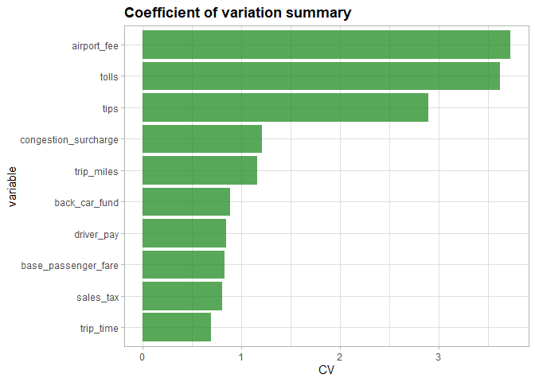

3.  `trip_miles`, `trip_time`, `base_passenger_fare`, `sales_tax` and
    `driver_pay` could be 0 of all of them a 0 at the same time,
    otherwise we need to **erase and input the values**.

4.  If `base_passenger_fare` and `driver_pay` are negative them we need
    to **erase and input the values** the passanger cannot charge the
    drive.

### Datetime variables distribution

As we can see below of the date time data is complete excepting the
`on_scene_datetime` which by definition measures the time when driver
arrived at the pick-up location for accessible vehicles. 70% of NYC
aren’t accessible vehicles so there is some thing wrong with that
description, so will be remove that column as the `pickup_datetime` also
measures the same time without missing values.

``` r
DatetimeSummary <-
  DecodedTrips[, .SD, .SDcols = is.POSIXct] |>
  skimr::skim()

DatetimeSummary
```

|                                                  |                             |
|:-------------------------------------------------|:----------------------------|
| Name                                             | DecodedTrips\[, .SD, .SDco… |
| Number of rows                                   | 10000000                    |
| Number of columns                                | 4                           |
| Key                                              | NULL                        |
| \_\_\_\_\_\_\_\_\_\_\_\_\_\_\_\_\_\_\_\_\_\_\_   |                             |
| Column type frequency:                           |                             |
| POSIXct                                          | 4                           |
| \_\_\_\_\_\_\_\_\_\_\_\_\_\_\_\_\_\_\_\_\_\_\_\_ |                             |
| Group variables                                  | None                        |

Data summary

**Variable type: POSIXct**

| skim_variable     | n_missing | complete_rate | min                 | max                 | median              | n_unique |
|:------------------|----------:|--------------:|:--------------------|:--------------------|:--------------------|---------:|
| request_datetime  |         0 |          1.00 | 2022-12-31 19:38:37 | 2023-03-31 20:05:00 | 2023-02-16 11:52:19 |  5225266 |
| on_scene_datetime |   2713591 |          0.73 | 2022-12-31 19:57:23 | 2023-03-31 19:59:52 | 2023-02-15 14:26:18 |  4435202 |
| pickup_datetime   |         0 |          1.00 | 2022-12-31 20:00:01 | 2023-03-31 19:59:59 | 2023-02-16 11:57:34 |  5254993 |
| dropoff_datetime  |         0 |          1.00 | 2022-12-31 20:04:38 | 2023-03-31 22:27:33 | 2023-02-16 12:20:47 |  5250094 |

``` r
# ggplot cannot support plotting 10 million points
set.seed(5184)
ggplot(DecodedTrips[!is.na(on_scene_datetime), 
                    .SD[sample.int(.N, 1e3)]],
       aes(on_scene_datetime, pickup_datetime))+
  geom_point(alpha = 0.08)
```

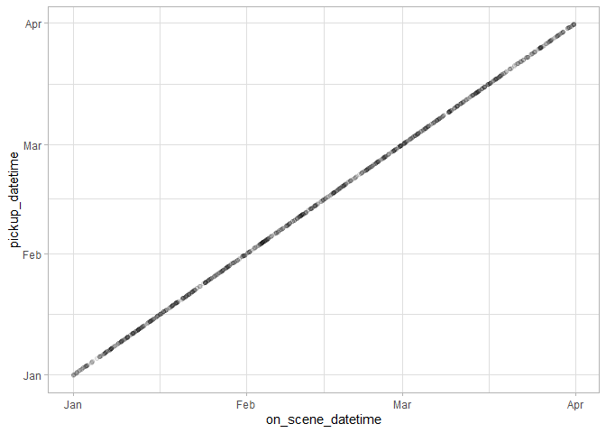

``` r
set.seed(NULL)
```

## References

- Taxi color: https://newyorksimply.com/green-taxis-nyc-cab/

- Number of accesible vehicles:
  https://www.rollxvans.com/handicap-accesible-taxis-nyc/#:~:text=Currently%20there%20are%20upwards%20of%2013%2C000%20taxis%20in,231%20of%20them%20are%20wheelchair%20accessible%20vehicle%20s.
