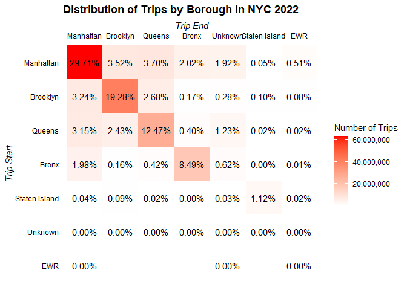
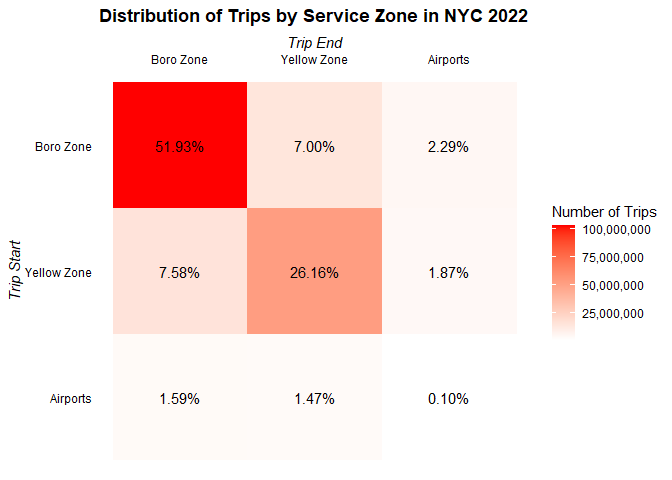
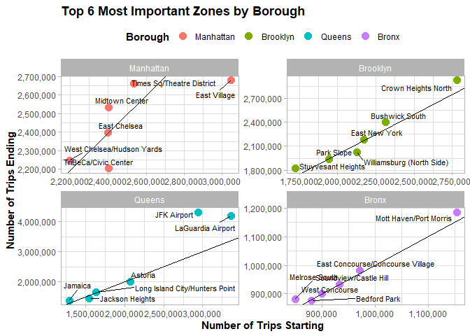

Exploratory Data Analysis (EDA) of 2022 High Volume For-Hire Vehicles
================

- <a href="#setting-the-environment-up"
  id="toc-setting-the-environment-up">Setting the environment up</a>
- <a href="#exploring-distribution-of-each-individual-variable"
  id="toc-exploring-distribution-of-each-individual-variable">Exploring
  distribution of each individual variable</a>
  - <a href="#categorical-variables"
    id="toc-categorical-variables">Categorical variables</a>

After completing the [business
understanding](https://github.com/AngelFelizR/nyc-taxi-project/tree/master/notebooks/02-business-understanding)
step, we have a clear objective in mind and an initial description for
each column the [raw
data](https://github.com/AngelFelizR/nyc-taxi-project/tree/master/data),
we are ready to perform the *data understanding* by performing an EDA
with the following steps:

1.  Examining the distribution of each individual variable by counting
    the categorical variables and creating histograms or box plots for
    numerical variables
2.  Defining the target variable and confirming its distribution
3.  Confirming domain knowledge relations by creating visualization with
    2 or more variables
4.  Taking a subset of the data to fit in RAM
5.  Exploring correlations between predictors by using a correlation
    matrix or running a PCA
6.  Removing high correlated predictors
7.  Exploring correlations between the target and predictors creating a
    correlation funnel and some scatter plots.

After completing this process, we will have the following outcomes:

- Confirming the meaning of each variable
- Ensuring data quality by finding missing values and
- Identifying the best models to train
- Creating new features that can enhance the predictive power of the
  machine learning model

## Setting the environment up

To setting the `R` environment up we just need to apply the following 4
steps:

1.  Loading the packages to use.

``` r
library(here)
library(data.table)
library(ggplot2)
library(scales)
library(forcats)
library(dplyr)
library(arrow)
```

2.  Sourcing the following custom functions to avoid repeating myself:

- `count_pct`: It counts the number rows where each unique value
  repeated in the columns selected arranging there results in descent
  order and adds a percentage column after collecting the results from
  `arrow`.
- `join_zones`:

``` r
source(here("R/01-custom-functions.R"))
```

3.  Creating an Arrow connection object to perform some manipulations in
    disk before taking the data into the RAM memory.

``` r
NycTrips2022 <- 
  here("data/trip-data/year=2022") |>
  open_dataset() |>
  mutate(company = case_when(
    hvfhs_license_num == "HV0002" ~ "Juno",
    hvfhs_license_num == "HV0003" ~ "Uber",
    hvfhs_license_num == "HV0004" ~ "Via",
    hvfhs_license_num == "HV0005" ~ "Lyft"
  )) |>
  select(-hvfhs_license_num)
```

4.  Importing the zone code description.

``` r
ZoneCodes <- fread(
  here("data/taxi_zone_lookup.csv"),
  colClasses = c("integer", "character", "character", "character")
)
```

5.  Counting the number of trips for each code, collecting and
    translating the zone codes.

``` r
TripsZoneDistribution <-
  NycTrips2022 |>
  count(PULocationID, DOLocationID) |>
  collect() |>
  join_zones(zone_tb = ZoneCodes)
```

## Exploring distribution of each individual variable

### Categorical variables

- `company`: The majority number of trips are done by *Uber* (HV003) and
  the rest for *Lyft*.

``` r
NycTrips2022 |> count_pct(company)
```

    # A tibble: 2 × 3
      company         n   pct
      <chr>       <int> <dbl>
    1 Uber    153847310 0.724
    2 Lyft     58568773 0.276

- `dispatching_base_num`: For most of the trips the dispatching number
  is **B03404** for Uber and **B03406** related for Lyft. Uber also has
  other 27 dispatching number, but they are really weird to see.

``` r
NycTrips2022 |>
  count_pct(company, dispatching_base_num) |>
  as.data.table() |>
  (\(dt) dt[, .(n_unique_code = n_distinct(dispatching_base_num),
                n_missing = sum(is.na(dispatching_base_num)),
                n = sum(n),
                pct = sum(pct) |> round(4L)),
            by = .(company,
                   common = pct > 0.01)
          ][order(-n)] )()
```

       company common n_unique_code n_missing         n    pct
    1:    Uber   TRUE             1         0 153732577 0.7237
    2:    Lyft   TRUE             1         0  58568773 0.2757
    3:    Uber  FALSE            27         0    114733 0.0005

- `originating_base_num`: This column has the same information as
  `dispatching_base_num` or has missing values, so we don’t need to use
  it.

``` r
NycTrips2022 |>
  count_pct(company,
            same_id = originating_base_num == dispatching_base_num)
```

    # A tibble: 5 × 4
      company same_id         n        pct
      <chr>   <lgl>       <int>      <dbl>
    1 Uber    TRUE    153844893 0.724     
    2 Lyft    NA       58497292 0.275     
    3 Lyft    TRUE        71481 0.000337  
    4 Uber    NA           1432 0.00000674
    5 Uber    FALSE         985 0.00000464

- `shared_request_flag`: Most of passengers don’t agree to a
  shared/pooled ride.

``` r
NycTrips2022 |> count_pct(shared_request_flag)
```

    # A tibble: 2 × 3
      shared_request_flag         n     pct
      <chr>                   <int>   <dbl>
    1 N                   210564721 0.991  
    2 Y                     1851362 0.00872

- `shared_match_flag`: From the subset of trips that agreed to share the
  ride only 24% achieved the match, we even can see some weird cases
  when the passenger did not initially agree to a shared/pooled ride
  (shared_request_flag = N), but ended up sharing the vehicle with
  another passenger who booked separately at some point during the trip
  (shared_match_flag = Y).

``` r
NycTrips2022 |> 
  count(shared_request_flag, shared_match_flag) |>
  collect() |>
  group_by(shared_request_flag) |>
  mutate(pct = n / sum(n)) |>
  arrange(desc(shared_request_flag), desc(shared_match_flag))
```

    # A tibble: 4 × 4
    # Groups:   shared_request_flag [2]
      shared_request_flag shared_match_flag         n      pct
      <chr>               <chr>                 <int>    <dbl>
    1 Y                   Y                    452035 0.244   
    2 Y                   N                   1399327 0.756   
    3 N                   Y                     47973 0.000228
    4 N                   N                 210516748 1.00    

- `access_a_ride_flag`: *Uber* isn’t reporting whether their trips were
  administered on behalf of the Metropolitan Transportation Authority
  and for *Lyft* the answer is always “N”, so we will **erase** this
  column as it doesn’t show any useful information.

``` r
NycTrips2022 |> count_pct(company, access_a_ride_flag)
```

    # A tibble: 2 × 4
      company access_a_ride_flag         n   pct
      <chr>   <chr>                  <int> <dbl>
    1 Uber    " "                153847310 0.724
    2 Lyft    "N"                 58568773 0.276

- `wav_request_flag`: It’s really unusual for a passenger to request a
  wheelchair-accessible vehicle.

``` r
NycTrips2022 |> count_pct(wav_request_flag)
```

    # A tibble: 2 × 3
      wav_request_flag         n     pct
      <chr>                <int>   <dbl>
    1 N                212142808 0.999  
    2 Y                   273275 0.00129

- `wav_match_flag`: If someone ask for a wheelchair-accessible vehicle
  it’s really often that passenger get that type of vehicle.

``` r
NycTrips2022 |> 
  count(wav_request_flag, wav_match_flag) |>
  collect() |>
  group_by(wav_request_flag) |>
  mutate(pct = n / sum(n)) |>
  arrange(desc(wav_request_flag), desc(wav_match_flag))
```

    # A tibble: 4 × 4
    # Groups:   wav_request_flag [2]
      wav_request_flag wav_match_flag         n    pct
      <chr>            <chr>              <int>  <dbl>
    1 Y                Y                 266935 0.977 
    2 Y                N                   6340 0.0232
    3 N                Y               12369744 0.0583
    4 N                N              199773064 0.942 

- `start_borough` and `end_borough`: After exploring the next
  distribution of trips we can highlight that:

  - 94% of the trips take place in *Manhattan*, *Brooklyn*, *Queens* and
    *Bronx*. As consequence, there is no reason to keep exploring trips
    related to *Staten Island*, *EWR* or *Unknown* as they are the
    minority.
  - 70% the trips take place without going to outside the start borough.

``` r
TripsZoneDistribution[, .(n = sum(n)),
                      by = c("start_borough", "end_borough")
][order(n)
][, c("start_borough", "end_borough") := 
    lapply(.SD, \(x) factor(x, levels = unique(x, fromLast = TRUE)) ),
  .SDcols = c("start_borough", "end_borough")
][, end_borough := fct_rev(end_borough)] |>
  ggplot(aes(end_borough, start_borough))+
  geom_tile(aes(fill = n)) +
  geom_text(aes(label = percent(n/sum(n), accuracy = 0.01))) +
  scale_fill_gradient(low = "white", 
                      high = "red",
                      labels= comma_format())+
  scale_x_discrete(position = "top") +
  labs(title = "Distribution of Trips by Borough in NYC 2022",
       x = "Trip End", 
       y = "Trip Start", 
       fill = "Number of Trips") +
  theme_classic() +
  theme(plot.title = element_text(face = "bold"),
        axis.ticks = element_blank(),
        axis.line = element_blank(),
        axis.text = element_text(color = "black"),
        axis.title = element_text(face = "italic"))
```



Let’s remove list the ids that we don’t need.

``` r
ZoneIdsToRemove <-
  TripsZoneDistribution[start_borough %chin% c("Staten Island", "Unknown", "EWR") |
                          end_borough %chin% c("Staten Island", "Unknown", "EWR"),
                        .(id = c(start_id, end_id))
  ][order(id), unique(id)]
```

- `start_service_zone` and `end_service_zone`: 52% of the trips take
  place at the *Boro Zone*, 26% of trips take place at the *Yellow Zone*
  and only small fraction goes to the *Airports*.

``` r
TripsZoneDistribution[!start_borough %chin% c("Staten Island", "Unknown", "EWR") &
                        !end_borough %chin% c("Staten Island", "Unknown", "EWR"), 
                      .(n = sum(n)),
                      by = c("start_service_zone", "end_service_zone")
][order(n)
][, c("start_service_zone", "end_service_zone") := 
    lapply(.SD, \(x) factor(x, levels = unique(x, fromLast = TRUE)) ),
  .SDcols = c("start_service_zone", "end_service_zone")
][, end_service_zone := fct_rev(end_service_zone)] |>
  ggplot(aes(end_service_zone, start_service_zone))+
  geom_tile(aes(fill = n)) +
  geom_text(aes(label = percent(n/sum(n), accuracy = 0.01))) +
  scale_fill_gradient(low = "white", 
                      high = "red",
                      labels= comma_format())+
  scale_x_discrete(position = "top") +
  labs(title = "Distribution of Trips by Service Zone in NYC 2022",
       x = "Trip End", 
       y = "Trip Start", 
       fill = "Number of Trips") +
  theme_classic() +
  theme(plot.title = element_text(face = "bold"),
        axis.ticks = element_blank(),
        axis.line = element_blank(),
        axis.text = element_text(color = "black"),
        axis.title = element_text(face = "italic"))
```



- `start_zone` and `end_zone`:

``` r
TripsZoneDistribution[!start_borough %chin% c("Staten Island", "Unknown", "EWR") &
                        !end_borough %chin% c("Staten Island", "Unknown", "EWR"), 
                      .(n = sum(n)),
                      by = c("start_borough", 
                             "start_zone", 
                             "end_borough",
                             "end_zone")
][,`:=`(same_borough = start_borough == end_borough,
        same_zone = fifelse(start_zone == end_zone, "Same Zone", "Diff Zone"),
        trip = paste0(start_zone,
                      fifelse(start_zone == end_zone,
                              "",
                              paste0(" - ", end_zone)),
                      "_",start_zone == end_zone) |>  reorder(n))
][order(-n), 
  .SD[1:10],
  by = "same_zone"] |>
  ggplot(aes(n, trip))+
  geom_col(aes(fill = same_borough))+
  scale_y_discrete(labels = \(x) gsub("_.+$","", x))+
  scale_x_continuous(labels = comma_format())+
  facet_wrap(~same_zone, ncol = 1, scales = "free")+
  theme_light() +
  theme(plot.title = element_text(face = "bold"),
        legend.position = "none",
        axis.ticks = element_blank(),
        axis.line = element_blank(),
        axis.text = element_text(color = "black"),
        axis.title = element_text(face = "italic"))
```


